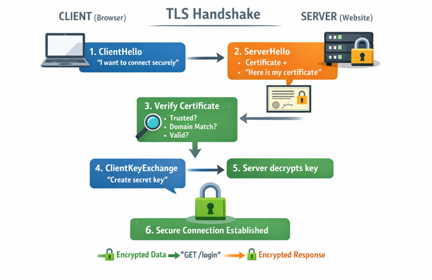

# PHASE 2 — 

#### Day 1 -

By the end of today, you should confidently say:

"Node.js lets JavaScript run outside the browser using the V8 engine."

If you can say this → Day 1 is successful.


## 1️⃣ What is Node.js ?

Node.js is a runtime that allows JavaScript to run on the server. That's it.

Before Node.js, JavaScript ran only in the browser.

It was mainly used for client-side tasks, such as:

→ Handling button clicks.

→ Form validation.

→ Simple UI interactions (show/hide elements, alerts)

UI logic.

❌ No backend
❌ No database
❌ No server logic


After Node.js, JavaScript can run:

→ on servers.

→ on your machine.

Can:

→ handle HTTP requests.

→ talk to databases.

→ read files.

→ build APIs.

👉 JavaScript became full-stack capable.


## 2️⃣ What makes Node.js powerful? (V8 Engine)

### What is V8?

→ V8 is a JavaScript engine written in C++ that executes JavaScript code.

→ Created by Google

→ Used in Chrome

→ Extremely fast

### Node.js = V8 + extra powers

Node.js wraps V8 and adds:

→ File system access

→ Network access

→ Timers

→ OS features


## 3️⃣ What Node.js is NOT ?

❌ Node.js is NOT:

→ a framework

→ a language

→ a database

✅ Node.js IS:

→ a runtime

→ an environment


## 4️⃣ How Node.js runs your code

Node.js runtime environment = V8 + Node APIs + libuv + OS

→ V8 → executes JS (Call Stack + Heap + Promise microtasks)

→ Node APIs → fs, http, crypto, timers, dns, child_process

→ libuv → event loop + thread pool + async I/O orchestration

→ OS → kernel networking (epoll/kqueue/IOCP), file system, process management


### V8 → executes JS (Call Stack + Heap + Promise microtasks)


V8 is the JavaScript engine that executes your code.

While executing JavaScript, V8 uses three core mechanisms:

1️⃣ Call Stack - Runs JavaScript synchronously, one function at a time.

2️⃣ Heap - Stores objects, arrays, and functions in memory.

3️⃣ Promise Microtasks - Stores Promise callbacks (.then, .catch) that run after the call stack is empty.

V8 does NOT know about files, HTTP, OS, or timers. It only executes JavaScript.


✅ Example - 


```js

console.log("1) Start");

// HEAP → Object stored in memory.

const user = { name: "Likan" };

function work() {
  console.log("2) Inside function");

  // Promise Microtask (V8) 

  Promise.resolve().then(() => {
    console.log("4) Promise microtask");
  });
}

// Call stack → Function Execution.

work();

console.log("3) End");

```

```js

Output -

1. Start
2. Inside function
3. End
4. Promise microtask


```

✅ EXPLANATION -

Step 1️⃣ - 

Call Stack (V8)

→ console.log("1") runs.

→ work() is pushed onto the call stack.

→ console.log("2") runs.

→ work() finishes and is popped.

→ console.log("3") runs.

👉 All synchronous code finishes first.


Step 2️⃣-

Heap (V8)

→ const user = { name: "Likan" };

→ The object { name: "Likan" } is stored in the heap

→ user holds a reference to it

👉 Objects are stored in heap because they are dynamic in size.


Step 3️⃣ - 

Promise Microtasks (V8). Promise.resolve().then(...)

→ This callback is placed in V8's microtask queue.

→ It waits until the call stack becomes empty.

→ After sync code completes → microtask runs.

👉 That’s why "Promise microtask" prints last.


### → Node APIs → fs, http, crypto, timers, dns, child_process

Node APIs - Node APIs are JavaScript functions provided by Node.js that allow your code to interact with the system.

JavaScript by itself (V8) cannot read files, create servers, use OS timers, do cryptography, resolve DNS, spawn processes.


→ Node.js exposes APIs through which JavaScript connects with the external world.

→ These APIs allow JavaScript to access files, networking, timers, security, and system resources.

→ Node.js APIs look like normal JavaScript functions.

→ Internally, these APIs are implemented in native C/C++ code.

→ The native code interacts with libuv and the operating system to perform the actual work.

→ JavaScript never talks to the OS directly — Node.js acts as the bridge.


#### Node.js Core Modules & APIs

A module exposes APIs, which are the functions and methods that developers can use in their code.

Examples - 


### 1️⃣ 📂 File Module — fs module


fs lets Node.js read, write, update, and delete files & folders by interacting with the operating system's file system.

→ Async APIs are non-blocking.

→ Sync APIs block the main thread.

#### 1.1 fs.readFile

```js

import fs from "fs";

fs.readFile("data.txt", "utf8", (err, data) => {
  console.log(data);
});

```

→ import fs from "fs" → loads file system module.

→ fs.readFile -> readFile API asynchronously reads a file from the OS file system where the Node.js process is running.

→ fs.readFile expects a file path(./files/data.txt), an encoding standard, and a callback function that executes after the file is read from the specified (relative or absolute) path.

→ "utf8" → convert buffer to string.

→ (err, data) → callback runs after file is read.

→ data → file content


👉 What happens if you don't use "utf8" - 

```js

fs.readFile("data.txt", (err, data) => {
  console.log(data);
});

```

Output: <Buffer 48 65 6c 6c 6f>

→ That's binary data, not human-readable text.


👉 What happens when you use it -

```js

fs.readFile("data.txt", "utf8", (err, data) => {
  console.log(data);
});

```

→ Output:   Hello


#### 1.2 fs.writeFile

```js

fs.writeFile("data.txt", "Hello", () => {
  console.log("File written");
});

```

→ fs.writeFile → An API that asynchronously writes data to a file on the operating system's file system.

→ "data.txt" → file path where the data will be written

→ "Hello" → the content to be written into the file.

→ Behavior:

    ✔ Creates the file if it does not exist

    ✔ Overwrites the file if it already exists

→ () => { ... } → callback function executed after the write operation completes.

→ console.log("File written") → confirms the file write was successful.


#### 1.3 fs.appendFile

```js

fs.appendFile("data.txt", " World", () => {});

```

→ fs.appendFile → an API that asynchronously appends data to a file on the operating system's file system.

→ "data.txt" → file path of the target file

→ " World" → content to be added at the end of the file.

→ Behavior:

    👉 Appends data without overwriting existing content

    👉 Creates the file if it does not exist

→ () => {} → callback function executed after the append operation completes.

→ fs.appendFile adds data to the end of a file without overwriting its existing contents


#### 1.4 fs.unlink (delete file)

```js

fs.unlink("data.txt", () => {});

```

→ fs.unlink → an API that asynchronously deletes a file from the operating system’s file system.

→ "data.txt" → file path of the file to be deleted

→ Behavior:

    👉 Permanently removes the file from disk

    👉 Fails if the file does not exist or permissions are insufficient

→ () => {} → callback function executed after the delete operation completes.


#### 1.5 fs.mkdir

```js

fs.mkdir("logs", () => {});

```

→ fs.mkdir → an API that asynchronously creates a directory in the operating system’s file system.

→ "logs" → name/path of the directory to be created

→ Behavior:

    👉 Creates the directory if it does not exist

    👉 Throws an error if the directory already exists.

→ () => {} → callback function executed after the directory creation completes.


#### 1.6 fs.stat

```js

fs.stat("data.txt", (err, stats) => {
  console.log(stats.size);
});

```

→ fs.stat → an API that asynchronously retrieves metadata (information) about a file or directory from the operating system’s file system.

→ "data.txt" → file path whose information is being requested


→ (err, stats) → callback executed after the OS returns file information.

→ stats → an object containing details such as:

    👉 file size

    👉 creation time

    👉 last modified time

whether it is a file or directory

→ stats.size → size of the file in bytes.


### 2️⃣ 🌐 HTTPS Module — https

The https module is used when Node.js needs to send or receive data securely over the internet.

Think of HTTPS as HTTP with a lock 🔒.

→ It is used when data should not be readable by others

→ It encrypts the data while sending or receiving it

→ This prevents:

    password leaks

    data stealing

    man-in-the-middle attacks


####  2.1 https.get

```js

import https from "https";

https.get("https://example.com", (res) => {
  res.on("data", chunk => console.log(chunk.toString()));
});


```


→ import https from "https" → loads the HTTPS module used for secure network communication.

→ https.get → an API that sends an HTTPS GET request to a secure URL.

→ "https://example.com" → the secure URL to which the request is sent.

→ (res) => { ... } → callback executed when the server sends a response.

→ res → a readable stream representing the response from the server.

→ res.on("data", ...) → listens for chunks of data arriving from the response stream.

→ chunk → a piece of the response data received from the network.

→ chunk.toString() → converts the received binary data (Buffer) into readable text.

→ Data arrives in parts → because network responses are streamed, not received all at once.


Response stream -

Imagine downloading a video:

→ The video is not downloaded fully

→ It is sent in small chunks

→ Your device plays each chunk as it arrives

→ That continuous flow of chunks is a stream.

Stream video = video that streams data continuously


#### 2.2 https.request


```js

https.request(options, res => {}).end();

```

→ https.request → an API that sends a customizable HTTPS request.

→ options → an object that defines request details such as:

    method (GET, POST, PUT, etc.)

    headers

    hostname

    path


→ res => {} → callback executed when the server sends a response.

→ res → response stream coming back from the server.

→ .end() → sends the request to the server. (required to actually make the request).


→ Used for:

    POST requests

    PUT requests

    sending request body

    custom headers

→ More control than https.get because you control method, headers, and body.

→ https.request is used when you need full control over how the HTTPS request is sent.


Full code Example - 

client.js - 

```js

import http from "http";

const options = {
  hostname: "jsonplaceholder.typicode.com",
  path: "/posts",
  method: "POST",
  headers: {
    "Content-Type": "application/json",
    "Content-Length": Buffer.byteLength(
      JSON.stringify({ title: "Hello", body: "World" })
    )
  }
};

const req = http.request(options, (res) => {
  let data = "";

  res.on("data", chunk => {
    data += chunk;
  });

  res.on("end", () => {
    console.log("Response:", data);
  });
});

req.on("error", (err) => {
  console.error("Error:", err);
});

req.write(JSON.stringify({ title: "Hello", body: "World" }));
req.end();

// This code uses Node.js as an HTTP client to send a request to a server.

```


Code Explanation - 

1️⃣ Import HTTP module

→ import http from "http"; loads Node.js’s built-in HTTP module

→ Used to send and receive HTTP requests

2️⃣ Request configuration (options)

```js

const options = {
  hostname: "jsonplaceholder.typicode.com",
  path: "/posts",
  method: "POST",
}

```

→ hostname → server address

→ path → endpoint on the server

→ method → HTTP method (POST means send data)


3️⃣ Headers

```js

headers: {
  "Content-Type": "application/json",
  "Content-Length": Buffer.byteLength(
    JSON.stringify({ title: "Hello", body: "World" })
  )
}

```

Content-Type → tells server data is JSON

Content-Length → size of request body in bytes
(server needs this to know how much data is coming)

👉 Buffer.byteLength(...) calculates exact byte size.


4️⃣ Create the HTTP request

```js

const req = http.request(options, (res) => { ... })

```

→ Creates an HTTP request

→ Does NOT send it yet

→ Callback runs when server responds.


5️⃣ Response handling (stream)

```js

let data = "";

```

→ Variable to store response data

6️⃣ Receive response chunks


```js

res.on("data", chunk => {
  data += chunk;
});

```

→ Server sends response in chunks.

→ "data" event fires for each chunk.

→ We keep appending chunks.


7️⃣ Response finished.

```js

res.on("end", () => {
  console.log("Response:", data);
});

```

→ "end" event fires once.

→ Means response is complete.

→ Safe to use full data now.


8️⃣ Handle request errors 

```js

req.on("error", (err) => {
  console.error("Error:", err);
});

```

→ Handles network or connection errors.

→ Prevents app crash.


9️⃣ Send request body.


```js

req.write(JSON.stringify({ title: "Hello", body: "World" }));

```

→  Sends JSON data to server

→  Required for POST / PUT requests


🔟 Finish and send request

```js

req.end();

```

→ Signals request is complete.

→ Actually sends the request.

→ Without this, request will never be sent.


🧩 Simple Flow -


```js

create request
   ↓
write request data
   ↓
end request
   ↓
server responds in chunks
   ↓
data → data → data → end

```

This code sends a POST request with JSON data and reads the server's response as a stream.


✅ HTTP Server -


```js

import http from "http";

const server = http.createServer((req, res) => {

  // Handle POST /posts
  if (req.method === "POST" && req.url === "/posts") {
    let body = "";

    // Read request body as stream
    req.on("data", (chunk) => {
      body += chunk;
    });

    // When body is fully received
    req.on("end", () => {
      try {
        const parsed = JSON.parse(body);

        res.writeHead(201, { "Content-Type": "application/json" });
        res.end(
          JSON.stringify({
            message: "Post created",
            received: parsed
          })
        );
      } catch {
        res.writeHead(400, { "Content-Type": "application/json" });
        res.end(JSON.stringify({ error: "Invalid JSON" }));
      }
    });

  } 
  
  else {
    // Handle all other routes
    res.writeHead(404, { "Content-Type": "text/plain" });
    res.end("Not found");
  }

});

server.listen(3000, () => {
  console.log("Server running on http://localhost:3000");
});


```


1️⃣ Import HTTP module

```js

import http from "http";

```

→ Loads Node.js built-in HTTP module
→ Required to create an HTTP server

2️⃣ Create the server -

```js

const server = http.createServer((req, res) => { .... })

```

→ Creates an HTTP server.
→ Callback runs for every incoming request.

req → incoming request object
res → response object to send data back


3️⃣ Basic routing -

```js

if (req.method === "POST" && req.url === "/posts") { ... } 

```

→ This checks HTTP method is POST and URL is /posts.

→ This is manual routing what Express does internally.


4️⃣ Prepare to read request body.

```js

let body = "";

```

→ Variable to collect incoming request data


5️⃣ Read request body as stream.

```js

req.on("data", (chunk) => {
  body += chunk;
});

```

→ Request body arrives in chunks.
→ "data" event fires for each chunk.
→ Chunks are appended to body.


6️⃣ Request body fully received

```js

req.on("end", () => { ... })

```

→ "end" fires once.
→ Means client finished sending data.
→ Safe to process full request body.


7️⃣ Parse JSON safely

```js

const parsed = JSON.parse(body);

```

→ Converts JSON string into JavaScript object
→ Wrapped in try/catch to handle invalid JSON

8️⃣ Send success response

```js

res.writeHead(201, { "Content-Type": "application/json" });

```

→ This sets HTTP status code 201 (Created)

Response content type

```js

res.end(JSON.stringify({
  message: "Post created",
  received:   parsed
}));

```

→ Sends JSON response to client
→ Ends the response

9️⃣ Handle invalid JSON

```js

res.writeHead(400, { "Content-Type": "application/json" });
res.end(JSON.stringify({ error: "Invalid JSON" }));

```

→ Sends 400 Bad Request
→ Client sent malformed JSON

🔟 The else block handles all unmatched routes and HTTP methods by returning a 404 response.

```js

 else {
    // Handle all other routes
    res.writeHead(404, { "Content-Type": "text/plain" });
    res.end("Not found");
  }

```

→ Runs if route/method doesn’t match
→ Sends 404 Not Found


1️⃣1️⃣  Start listening on port

```js

server.listen(3000, () => {
  console.log("Server running on http://localhost:3000");
});

```

→ Server starts listening on port 3000
→ Ready to accept requests


Note - When data is received in chunks, the "data" event is fired every time a new chunk of request data arrives.


### ✅ How to test with your client

Change your client options to -

→ hostname: "localhost",
→ path: "/posts",
→ port: 3000,
→ method: "POST",

Then run - 

→ node server.js
→ node client.js


#### 2.3 https.createServer

```js

https.createServer(options, (req, res) => {
  res.end("Secure");
}).listen(443);

```

→ https.createServer → an API that creates an HTTPS server.

→ options → an object that provides TLS configuration such as:

    👉 key (private key)

    👉 cert (SSL/TLS certificate)

→ (req, res) => { ... } → callback executed for every incoming HTTPS request.

→ req → incoming request object from the client.

→ res → response object used to send data back to the client.

→ res.end("Secure") → sends the response and closes the connection.

→ .listen(443) → starts the HTTPS server on port 443 (default HTTPS port).

→ HTTPS requires a certificate and private key to enable encrypted communication.


 

### 3️⃣ ⏱ Timer APIs

→ Used to schedule execution

→ Provided globally by Node


#### 3.1 setTimeout

→ setTimeout is a timer API provided by Node.js

→ It schedules a function to run after a specified delay

→ It is asynchronous and non-blocking

→ The delay is a minimum wait time, not a guarantee

👉 JavaScript does not pause while waiting.


```js

setTimeout(() => {
  console.log("Runs once");
}, 1000);

```


→ setTimeout - Registers a timer in the Node.js environment.

→ () => { ... } - The callback function that should run later.

→ console.log("Runs once") - The code that will execute after the delay.

→ 1000 - Delay in milliseconds (1000 ms = 1 second).

→ While waiting

    👉 JavaScript continues executing other code

    👉 The program does not pause or block

→ After at least 1 second (and when the call stack is free)

    👉 The callback function is executed

    👉 "Runs once" is printed


#### 3.2 setInterval 

→ setInterval is a timer API provided by Node.js

→ It schedules a function to run repeatedly at fixed intervals

→ It is asynchronous and non-blocking

→ The interval time is a minimum delay between executions

👉 JavaScript does not pause while waiting


```js

setInterval(() => {
  console.log("Runs repeatedly");
}, 1000);


```

→ setInterval - Registers a repeating timer in the Node.js environment.

→ () => { ... } - The callback function that should run repeatedly.

→ console.log("Runs repeatedly") - The code that executes on every interval.

→ 1000 - Interval time in milliseconds (1000 ms = 1 second).

→ While running

👉 JavaScript continues executing other code.
👉 The program does not block.
👉 The callback runs again and again.

→ Every ~1 second (when the call stack is free)

👉 The callback function is executed
👉 "Runs repeatedly" is printed each time


#### 3.3 setImmediate - 


→ setImmediate is a timer API provided by Node.js

→ It schedules a function to run after the current I/O operations complete

→ It is asynchronous and non-blocking

→ It runs as soon as possible, not after a time delay

👉 JavaScript does not pause while waiting

```js

setImmediate(() => {
  console.log("Runs after I/O");
});

```

→ setImmediate → registers a callback in the Node.js event loop (check phase).

→ () => { ... } - The callback function that should run later.

→ console.log("Runs after I/O") - The code that executes when the callback runs.

→ While waiting

👉 JavaScript continues executing other code.
👉 The program does not block.

→ After I/O callbacks finish (and when the call stack is free)

👉 The callback function is executed.
👉 "Runs after I/O" is printed.


## What does “After I/O callbacks finish” mean?

## what is I/O?

I/O = Input / Output, for example:

→ Reading a file (fs.readFile)

→ Network request

→ Database call

These operations:

    👉 Take time

    👉 Run outside JavaScript

    👉 Call back later


## What happens in Node.js ?

```js

console.log("A");

fs.readFile("file.txt", () => {
  console.log("File read");
});

setImmediate(() => {
  console.log("Immediate");
});

console.log("B");

```

1️⃣ "A" prints
2️⃣ fs.readFile starts (I/O begins in background)
3️⃣ setImmediate is registered
4️⃣ "B" prints

⏳ Now Node.js is waiting…

5️⃣ File read finishes → I/O callback is ready
6️⃣ After I/O callbacks, Node runs setImmediate

So output is usually:

A
B
File read
Immediate


## why setImmediate does NOT run immediately ?

Despite the name:

❌ It does NOT run right after the current line.
❌ It does NOT run like process.nextTick.
❌ It does NOT use time (milliseconds).

✅ It waits until:

→ I/O callbacks are handled
→ Call stack is empty


### 4️⃣ 🔐 Crypto Module — crypto


→ 'crypto' module provides security-related functions in Node.js.

→ Used for - 

    👉 password hashing.

    👉 encryption / decryption.

    👉 generating secure keys & tokens.

→ pbkdf2 is a password-hashing function

→ The async version is non-blocking.

    👉 Heavy work runs in the libuv thread pool.

    👉 JavaScript main thread stays free.


```js

import crypto from "crypto";

crypto.pbkdf2("pass", "salt", 1000, 64, "sha512", (err, key) => {
  console.log(key.length);
});


```

→ import crypto from "crypto" loads Node.js’s built-in cryptography module.

→ crypto.pbkdf2(...) starts a secure password-hashing operation.

→ "pass" - The password to be hashed.

→ "salt" → A random value added to the password
→ Prevents rainbow table attacks.
→ Makes hashes unique even for same passwords.

→ 1000 - Number of iterations
→ More iterations = slower = more secure.

→ 64 - Length of the output key in bytes.

→ "sha512" - The hashing algorithm used internally.

→ (err, key) => { ... } - Callback runs after hashing finishes.

→ key - The generated secure hash (Buffer).

→ key.length - Prints the length of the derived key.

→ crypto.pbkdf2 does not block JavaScript.

→ The heavy hashing work runs in the background thread pool.

→ When done, the callback is queued and executed safely

crypto.pbkdf2 securely hashes passwords asynchronously using multiple iterations without blocking the main thread.


### 5️⃣ 🌍 DNS module — dns


→ dns is used to convert a domain name into an IP address

→ dns is required for networking because computers communicate using IP addresses, not names.

→ DNS works before any server is contacted.

→ DNS connects the client to the server by telling the client where the server is.

→ Node.js dns module uses the operating system's DNS resolver


```js

import dns from "dns";

dns.lookup("google.com", (err, address) => {
  console.log(address);
});


```

👉 This code is written and executed in a Node.js environment (backend / Node.js script), not in the browser.


Code Explanation - 

→ import dns from "dns" → loads Node.js's built-in DNS module.

→ dns.lookup(...) → asks the operating system to resolve a domain name.

→ "google.com" → The human-readable domain name to resolve.

→ (err, address) => { ... } →  Callback function that runs after DNS resolution completes.

→ address →  The IP address corresponding to the domain name.


## What IS DNS?

DNS (Domain Name System) is like the phonebook of the internet.

👉 Humans remember names.

👉 Computers/servers understand IP addresses

DNS connects the two.

## How DNS works

When you type: google.com in the browser

This happens:

google.com
   ↓
DNS system
   ↓
IP address (e.g. 142.250.xxx.xxx)
   ↓
Browser / client connects to that IP
   ↓
Google server receives the request


👉 DNS only tells where the server is.

👉 It does not know or check what's inside the server.


### 6️⃣ 👶 Child Process — child_process

→ The child_process module allows Node.js to run operating system commands.

→ Used for automation scripts, running CLI tools (git, npm), executing binaries, background jobs.

→ Node.js cannot run OS commands directly.

→ A new OS-level process is created to execute the command.


#### 6.1 exec

→ Executes a command in a shell. (bash / sh / cmd)

→ Collects the entire output in memory.

→ Returns the result only after the command finishes.

→ Suitable for short commands with small output.


```js

import { exec } from "child_process";

exec("node -v", (err, stdout) => {
  console.log(stdout);
});


```

→ import { exec } from "child_process" → Imports the exec function from Node.js’s built-in child_process module.

→ exec("node -v", ...) → Tells the OS to start a new shell process and run the command.

→ "node -v" → OS command that prints the installed Node.js version.

→ (err, stdout) => { ... } → Callback executed after the command finishes.

→ stdout → Contains the entire output of the command → Output is stored in memory.


#### 6.2 spawn

→ Executes the command directly as a process (no shell by default)

→ Streams output chunk by chunk

→ Returns output step by step (shows output while running)

→ Suitable for large output or long-running commands


```js 

import { spawn } from "child_process";

const child = spawn("ls");

child.stdout.on("data", (data) => {
  console.log("Output chunk:", data.toString());
});

child.on("close", (code) => {
  console.log("Process finished with code:", code);
});

```

👉 import { spawn } from "child_process"

    → Imports the spawn function from Node.js built-in 'child_process' module.

    → spawn function is Used to create a new OS-level process

👉 const child = spawn("ls"); 

  → This Starts a new process and runs the 'ls' command.
  
  → The 'ls' command is executed directly as a process (no shell by default).
  
  → This returns a ChildProcess object child . 
  
  → child represents the running OS process.

👉 child.stdout.on("data", (data) => { ... } 

  → Listens for output from the command.

  → Runs every time the command prints something.

  → You see the output while the command is still running.


👉 console.log("Output chunk:", data.toString());

  → data is a Buffer containing part of the output.
  
  → toString() converts the buffer into readable text.
  
  → Logs each chunk as it arrives.


👉 '});' closes the 'stdout' data event handler.


👉 child.on("close", (code) => { .... }

    → Listens when the command finishes running.

    → 'close' event gets triggered when the child process fully exits.

    → This confirms that all output has been sent and closed.


👉 console.log("Process finished with code:", code);

 callback executes the console log statement when 'close' event is triggered.

  → code is the exit code of the process
  
  → 0 usually means success
  
  → Non-zero means error or abnormal exit


👉 '});' Closes the close event handler


Key points - 

→ Process starts.

→ Output is streamed chunk by chunk.

→ You see output while it runs.

→ Final message appears when process ends.


### 7️⃣ ⚙️ Process Module — process


→ The process module represents the currently running Node.js process.

→ It provides information about:

    👉 process state  
    👉 environment variables  
    👉 command-line arguments  
    👉 process control (exit, signals)

→ process is a global object in Node.js.
→ No import is required.


Common process APIs - 

```js

console.log(process.pid);
console.log(process.env.NODE_ENV);
process.exit(0);

```


Code Explanation - 

→ process.pid returns the process ID assigned by the operating system.
→ Used for debugging and monitoring

→ process.env.NODE_ENV
→ Reads an environment variable
→ Common values: "development", "production"
→ Used to control app behavior based on environment

→ process.exit(0)
→ Immediately terminates the Node.js process
→ 0 means successful exit
→ Non-zero values indicate an error
→ process.exit() stops everything immediately
→ Pending async operations are not completed
→ Use carefully


### 8️⃣ 🖥 OS Module — os

→ The os module provides information about the operating system on which Node.js is running.

→ os module used to read -

    👉 CPU details.  
    👉 memory information.
    👉 operating system type.  
    👉 platform-specific data.  


→ It is used for monitoring, optimization.

→ The os module is read-only.

→ It does not modify the operating system.


Common os APIs -

```js

import os from "os";

os.cpus();      
os.totalmem();  
os.freemem();   
os.platform();  

```

→ import os from "os"
→ Loads Node.js’s built-in operating system module.


→ os.cpus()
→ Returns information about CPU cores
→ Includes: number of cores, model, speed

→ os.totalmem()
→ Returns the total system memory (in bytes).


→ os.freemem()
→ Returns the available free memory (in bytes).


→ os.platform()
→ Returns the operating system platform
→ Examples: "linux" , "darwin" (macOS) , "win32" (Windows)


### 9️⃣ 📁 Path Module — path


→ The path module is used to work with file and directory paths.

→ It helps Node.js handle paths correctly across operating systems.

→ Different OS use different path formats:

Windows → \

Linux / macOS → /

→ path solves this problem by normalizing paths.

## Why path is needed?

❌ Hard-coding paths is risky: "/users/app/data/file.txt"

✔ Using path is safe and portable.

Common path APIs

```js

import path from "path";

path.join();     // OS-safe path joining

path.resolve();  // Absolute path from current working directory

path.basename(); // File name extraction.

path.dirname();  // Directory extraction.

path.extname();  // File extension extraction.

```


```js

import path from "path";

// Assume this file is running from: '/home/node/app/index.js'

const projectRoot = "/home/node/app";

// Build a path to: /home/node/app/logs/app.log

const logFilePath = path.join(projectRoot, "logs", "app.log");

console.log(logFilePath);

// Output (Linux/macOS): /home/node/app/logs/app.log

// Output (Windows): \home\node\app\logs\app.log

// Get only the file name.

console.log(
  path.basename(logFilePath) // Output: app.log
);

// Get only the directory path

console.log(
  path.dirname(logFilePath)  // Output: /home/node/app/logs
);

// Get the file extension

console.log(
  path.extname(logFilePath) // Output: .log
);


// Convert a relative path to absolute path

console.log(
  path.resolve("logs", "app.log") // Output: /home/node/app/logs/app.log
);


```


📌 Node APIs do not execute JavaScript logic — they delegate work.


### How V8 executes below code - 

```js

import fs from "fs";
import http from "http";
import crypto from "crypto";

// Timer API

setTimeout(() => {
  console.log("1) Timer finished");
}, 1000);

// File System API

fs.readFile("test.txt", "utf8", (err, data) => {
  console.log("2) File read");
});

// Crypto API

crypto.pbkdf2("pass", "salt", 100000, 64, "sha512", () => {
  console.log("3) Crypto done");
});

// HTTP API

const server = http.createServer((req, res) => {
  res.end("Hello");
});

server.listen(3000, () => {
  console.log("4) Server running");
});

console.log("5) End of main JS");

```


1️⃣ V8 runs the file top to bottom (synchronous JS).

2️⃣ setTimeout
→ Timer registered with Node / libuv.
→ JS does not wait.

3️⃣ fs.readFile
→ File read handed to libuv thread pool.
→ Non-blocking.

4️⃣ crypto.pbkdf2
→ CPU-heavy hashing sent to libuv thread pool.
→ Non-blocking.

5️⃣ server.listen(3000)
→ OS opens a network socket.
→ Callback queued when ready.

6️⃣ console.log("5. End of main JS")
→ Runs immediately.


Output - 

1️⃣ 5) End of main JS

→ Runs immediately

→ Synchronous code

→ Printed while V8 is still executing the main file


2️⃣ 4) Server running

→ Printed when the OS finishes binding to port 3000

→ server.listen callback is executed by the event loop

→ Usually happens right after main JS finishes


3️⃣ 2) File read / 3) Crypto done

→ Both are asynchronous

→ Both use the libuv thread pool

→ Whichever finishes first is printed first

→ Order is not guaranteed


4️⃣ 1) Timer finished

→ Runs after ~1000 ms

→ Executed in the timers phase

→ May be slightly delayed if the event loop is busy


Key rule - 

V8 runs sync JS only

Async work runs outside JS

Callbacks return via event loop

This is the shortest correct explanation.

 
## Interview-ready definition.

"Node.js is a JavaScript runtime built on the V8 engine that allows JavaScript to run outside the browser."

This line is perfect for interviews.


### libuv → event loop + thread pool + async I/O orchestration


## What is libuv in Node.js?

libuv is a C library that powers Node.js’s asynchronous behavior. It runs the event loop, manages the thread pool, and coordinates async I/O with the operating system.

## What are the main responsibilities of libuv?

libuv has three main responsibilities:

→ Event loop → decides when callbacks should run

→ Thread pool → executes blocking or CPU-heavy work

→ Async I/O glue  → coordinates asynchronous operations with the OS.

Async I/O glue → It means libuv connects Node.js and the OS so async work can happen without blocking JavaScript.

## Does libuv execute JavaScript code?

No. libuv does not execute JavaScript. JavaScript execution is handled by the V8 engine. libuv only schedules callbacks and manages asynchronous operations.

## How is libuv different from V8?

V8 executes JavaScript code using the call stack and heap. libuv manages asynchronous behavior such as scheduling callbacks, handling background work, and communicating with the operating system.

## Why does Node.js need libuv?

Node.js needs libuv to achieve non-blocking behavior. libuv allows Node.js to perform file system, network, and CPU-intensive tasks asynchronously without blocking the JavaScript thread.

## What kind of work runs in the libuv thread pool?

Blocking or CPU-heavy tasks such as file system operations, cryptographic hashing, and DNS lookups run in the libuv thread pool.


##  How does libuv interact with the operating system?

libuv connects Node.js with the operating system.
It asks the OS to do work like networking, file access, and process creation, and when that work is finished, it notifies JavaScript by running the callback.

## Can Node.js work without libuv?

No. Without libuv, Node.js would not be able to handle asynchronous I/O efficiently. libuv is a core part of what makes Node.js non-blocking and scalable.

## What problem does libuv solve in simple terms?

libuv allows Node.js to do slow or heavy work in the background while keeping the JavaScript thread free to handle incoming requests.

## One-line interview summary

libuv enables Node.js’s non-blocking behavior by running the event loop, managing background work in the thread pool, and coordinating async I/O with the OS.


## What is  Event Loop ?

→ The event loop is a gatekeeper / scheduler.

→ Its job is very simple:

When the Call Stack is empty, pick the next ready callback and run it.

→ It does NOT:

      👉 read files

      👉 handle network

      👉 do heavy work

→ It only decides WHEN callbacks run.

## Who does what ? 


🟢 V8 Engine — Executes JavaScript code

→ V8 runs JavaScript only (not OS work)

→ V8 has a Call Stack → Executes synchronous JavaScript code

→ V8 has a Heap → Stores objects, arrays, functions (memory)

→ V8 has a Microtask Queue → Stores Promise callbacks (.then, .catch, .finally)


🟡 libuv (Node.js async engine)

→ Runs the event loop (decides when callbacks run)

→ Manages the thread pool → handles blocking / CPU-heavy tasks (fs, crypto, dns)

→ Talks to the Operating System → networking, file system, process management


🔵 Operating System (OS)

→ Performs the actual low-level work

Handles:

Networking
→ TCP/UDP sockets
→ HTTP connections
→ kernel networking (epoll / kqueue / IOCP)

File system
→ disk read/write
→ file metadata

Process management
→ create processes
→ assign PIDs
→ manage CPU & memory

👉 Node never does OS work directly.


## Event Loop flow - 


→ JavaScript runs synchronous code on the V8 call stack

→ Async tasks are delegated
    → OS (network, sockets)
    → libuv thread pool (fs, crypto)

→ The call stack becomes empty

→ The event loop checks queues
    → microtasks first
    → then event loop phases (timers, I/O, check…)

→ The event loop selects one ready callback

→ That callback is pushed onto the V8 call stack

→ V8 executes the JavaScript callback

→ The process repeats continuously


## Eventloop phases - 

The event loop runs again and again. Each round goes through these phases in the same order.

All event loop phases - 

1. Timers
2. Pending callbacks
3. Idle / Prepare
4. Poll
5. Check
6. Close callbacks


## 1️⃣ Timers Phase -

→ Runs callbacks from setTimeout , setInterval

→ Only runs after time is over

Example -

```js

setTimeout(() => console.log("timer"), 0);

```

Meaning -

→ "Run this later"

→ NOT immediately


## 2️⃣ Pending Callbacks Phase - 

→ Runs some internal callbacks

→ system errors

→ low-level stuff

As a developer - 

→ You don’t control this

→ Just know it exists

👉 Say this in interview:

"It’s for internal Node callbacks."


## 3️⃣ Idle / Prepare Phase

→ libuv internal work
→ No JavaScript runs here

You can safely say: "Internal phase, not user-facing."


## 4️⃣ Poll Phase - 

→ This is where real async work finishes

→ Runs callbacks from:

      fs.readFile

      network responses

      incoming requests

→ What happens here -

      If I/O is ready → run callback.

      If nothing is ready wait for I/O OR go to setImmediate.

→ Poll phase can wait or run


## 5️⃣ Check Phase 

→ Runs callbacks from: setImmediate

Example - 


```js

setImmediate(() => console.log("immediate"));

```

→ Inside file/network callbacks , setImmediate usually runs before setTimeout(0)


## 6️⃣ Close Callbacks Phase

→ Runs cleanup callbacks:

      socket closed

      stream closed

→ Example - socket.on("close", () => console.log("closed"));


→ Just cleanup. Nothing fancy.


## ⚡ Microtasks 

These run between every phase.

Order: 1. process.nextTick  2. Promise callbacks (then)

→ They run after sync code, after every callback.

→ Too many nextTick calls = app freezes


## Full Phase - 

Timers → Pending → Idle → Poll → Check → Close → repeat


→ Event loop schedules callbacks; V8 executes JavaScript.

## Example -

```js

import fs from "fs";

console.log("1) sync start");

// 🟢 Timers phase
setTimeout(() => {
  console.log("2) setTimeout (timers phase)");
}, 0);

// 🟢 Check phase
setImmediate(() => {
  console.log("3) setImmediate (check phase)");
});

// 🔴 Microtasks
process.nextTick(() => {
  console.log("4) process.nextTick (microtask)");
});

Promise.resolve().then(() => {
  console.log("5) promise then (microtask)");
});

// 🟡 Poll phase (I/O)
fs.readFile("test.txt", () => {
  console.log("6) fs.readFile callback (poll phase)");

  // Inside I/O
  setTimeout(() => {
    console.log("7) timeout inside fs (timers)");
  }, 0);

  setImmediate(() => {
    console.log("8) immediate inside fs (check)");
  });

  process.nextTick(() => {
    console.log("9) nextTick inside fs (microtask)");
  });
});

console.log("10) sync end");


```

Expected Output -

1) sync start
10) sync end
4) process.nextTick (microtask)
5) promise then (microtask)
2) setTimeout (timers phase)
3) setImmediate (check phase)
6) fs.readFile callback (poll phase)
9) nextTick inside fs (microtask)
8) immediate inside fs (check)
7) timeout inside fs (timers)


step 1: Sync code first
1) sync start
10) sync end

Step 2: Microtasks (highest priority)
process.nextTick
promise.then

Step 3: Event loop starts
setTimeout → Timers phase
setImmediate → Check phase
fs.readFile → Poll phase

Step 4: Inside fs.readFile
Order becomes:
process.nextTick
setImmediate
setTimeout

👉 Because:
Microtasks always first
Poll → Check runs before next Timers

Outside I/O → Timers first
Inside I/O → Check first


## In Node.js, the event loop order is Timers → Poll → Check. Then why does setImmediate() sometimes execute before an I/O callback like fs.readFile()?

Because the Poll phase only runs I/O callbacks that are ready.

If the file read is not finished yet, Poll has nothing to run, so Node moves to the Check phase.

setImmediate() runs in the Check phase, so it executes before the file read callback.


### Thread pool — what it is, what it executes


→ A small pool of background threads (default = 4) managed by libuv.

→ Thread pool Executes blocking / CPU-heavy work such as

      → fs (some file system operations)

      → crypto (pbkdf2, scrypt)

      → dns.lookup

      → zlib compression

❌ V8 does not run this work.

❌ Event loop does not run this work.

✅ libuv thread pool runs it and notifies the event loop when done.

## Thread Pool Example - Crypto hashing (CPU-heavy)


```js

import crypto from "crypto";

console.log("1) start");

for (let i = 1; i <= 6; i++) {
  crypto.pbkdf2("pass", "salt", 200000, 64, "sha512", () => {
    console.log(`2) hash done ${i}`);
  });
}

console.log("3) end");

```

output -

1) start
3) end
2) hash done 1
2) hash done 2
2) hash done 3
2) hash done 4
2) hash done 5
2) hash done 6

(Order of hash numbers may vary)

## Code Explanation -

1️⃣ JS runs sync code

start → end


2️⃣ Each pbkdf2 task is sent to the libuv thread pool.

3️⃣ Only 4 tasks run at the same time (default pool size).

4️⃣ Remaining tasks wait in queue.

5️⃣ When a thread finishes:

→ libuv sends the callback to the event loop

→ event loop pushes it to V8 call stack

→ JS callback executes

Key understanding - 

→ Thread pool does the heavy work.

→ Event loop only schedules the callback.

→ V8 only executes JavaScript.


Node offloads CPU-heavy and blocking operations to the libuv thread pool so the JavaScript thread remains non-blocking.

In our Example Node.js sends all 6 crypto tasks to the libuv thread pool; with a default size of 4, four run in parallel and the remaining two wait in the queue.


### Async I/O orchestration — what it is, what it executes


## 🌐 Async I/O orchestration - what it is, what it executes.

Async I/O orchestration means the OS does the I/O work, and when that work finishes, libuv receives the result and gives the callback to Node.js to execute.

→ libuv works as a middleman between Node.js and the OS.

→ When the OS can do the work by itself (like network I/O), libuv lets the OS handle it without blocking JavaScript.


## What Async I/O orchestration mainly handles

→ Network sockets

     → HTTP servers

     → TCP / UDP connections

→ WebSockets

     → OS signals / events

     → socket is readable or writable

     → new connection arrived

     → data received from network


## What does NOT run here ?

❌ No JavaScript execution.
❌ No business logic.
❌ No CPU-heavy work.
❌ No libuv thread-pool usage.


## Who does what ?

OS
→ Performs actual networking (send/receive packets)

libuv
→ Registers interest in OS events.
→ Listens those events using epoll / kqueue / IOCP
→ Converts OS events into callbacks.

Event loop
→ Decides when callbacks should run

V8
→ Executes your JavaScript callback


🧪 Async I/O Example (Network – HTTP Server)


```js

import http from "http";

const server = http.createServer((req, res) => {
  console.log("request received");
  res.end("Hello");
});

server.listen(3000, () => {
  console.log("server running");
});

```

What is happening ? 

1️⃣ Client sends HTTP request.
2️⃣ OS receives network packet.
3️⃣ OS notifies libuv: "socket is readable"
4️⃣ libuv queues callback for event loop
5️⃣ Event loop picks callback
6️⃣ V8 executes JS handler
7️⃣ Response is sent back


→ "Async I/O orchestration is libuv listening to OS-level I/O events and routing them to the Node.js event loop without blocking the JS thread."

→ libuv listens to OS events and turns them into callbacks that Node.js can run.


##  One Code Example that covers ALL Eventloop + Thread pool + Async I/O orchestration


```js

import fs from "fs";
import crypto from "crypto";
import http from "http";

console.log("A) sync start");

// -------------------- Event loop (microtasks) --------------------

Promise.resolve().then(() => console.log("B) promise microtask"));
process.nextTick(() => console.log("C) nextTick"));

// -------------------- Event loop (timers) --------------------

setTimeout(() => console.log("D) setTimeout (timers phase)"), 0);

// -------------------- Event loop (check phase) --------------------

setImmediate(() => console.log("E) setImmediate (check phase)"));

// -------------------- Thread pool (fs) --------------------

fs.readFile("test.txt", "utf8", () => {
  console.log("F) fs.readFile done (thread pool -> callback)");
});

// -------------------- Thread pool (crypto) --------------------

crypto.pbkdf2("pass", "salt", 100000, 64, "sha512", () => {
  console.log("G) crypto.pbkdf2 done (thread pool -> callback)");
});

// -------------------- Async I/O orchestration (OS networking) ------

const server = http.createServer((req, res) => {
  res.end("OK");
});

server.listen(3000, () => {
  console.log("H) server listening (OS socket ready)");
});

console.log("I) sync end");

```

## Output Sequence - 

1️⃣ Synchronous code runs first (V8)

Node.js starts by executing all synchronous JavaScript on the call stack.

So these run immediately:

"A) sync start"

"I) sync end"

Nothing async runs before this finishes.

2️⃣ Microtasks run next (highest priority)

After synchronous code completes, Node.js immediately flushes microtasks.

Microtask order is:

process.nextTick

Promise callbacks

So this runs next:

"C) nextTick"

"B) promise microtask"

Even though the Promise was written first, process.nextTick always runs before Promises in Node.js.

3️⃣ Event loop starts — first iteration

Now the event loop begins.

4️⃣ Timers phase

setTimeout(..., 0) is now eligible to run.

So you typically see:

"D) setTimeout (timers phase)"

(The delay is minimum 0 ms, not guaranteed exact timing.)

5️⃣ Check phase

Next, the event loop reaches the Check phase, where setImmediate callbacks run.

So this prints:

"E) setImmediate (check phase)"

6️⃣ Thread pool work completes (order not guaranteed)

Meanwhile, two heavy tasks were running in parallel in the libuv thread pool:

fs.readFile

crypto.pbkdf2

When each one finishes:

libuv queues its callback

the event loop schedules it

V8 executes the callback

So these messages appear when their work finishes:

"F) fs.readFile done (thread pool -> callback)"

"G) crypto.pbkdf2 done (thread pool -> callback)"

⚠️ Their relative order is not guaranteed.
Either one may print first depending on timing and system load.

7️⃣ Async I/O orchestration (OS networking)

The HTTP server setup does not block JavaScript.

The OS creates a listening socket

libuv listens for readiness

When the socket is ready, Node.js runs the callback

So this prints:

"H) server listening (OS socket ready)"

This may appear before or after thread-pool callbacks, depending on how fast the OS responds.


### OS → kernel networking (epoll/kqueue/IOCP), file system, process management


Node.js itself does NOT do low-level work.

Node.js is just a coordinator.

Real work is done by:

Your JS code
   ↓
Node APIs
   ↓
libuv
   ↓
Operating System (kernel)


So whenever you feel lost, remember this rule: JS never touches hardware. The OS always does.


## OS watches thousands of sockets

## 🧩 What is a socket? 

A socket = an open network connection.

Example:

Browser → your Node server

Each user = one socket

If 5,000 users are connected:
👉 You have 5,000 sockets


## ❌ BAD WAY (old systems — polling)

What the program does.

The application itself keeps checking every socket:

Is socket 1 ready?
Is socket 2 ready?
Is socket 3 ready?
...

Why this is bad ? 

❌ Slow – checking again and again

❌ CPU-wasting – CPU runs even when nothing happens

❌ Impossible at scale – fails with thousands of sockets

Who is doing the work here?

👉 Your application code

The OS only answers questions.

Your program keeps asking repeatedly.

This is called polling.


## GOOD WAY (modern OS design)

What the program does instead

The application tells the OS:

" Here are all my sockets. You watch them. Wake me only when something happens. "

What happens now ?

→ The application goes to sleep

→ The OS kernel watches the sockets

→ CPU is idle

→ Application wakes only when required

→ No looping.

→ No repeated checking.

→ No wasted CPU.


## 📌 How the OS does this (mechanisms)

Different operating systems expose different APIs:

OS	      Mechanism
Linux	    epoll
macOS	    kqueue
Windows	  IOCP

They all solve the same problem:

Efficiently wait for I/O events without wasting CPU.

## What exactly do epoll / kqueue / IOCP watch?

This is the core concept.

They do NOT watch JavaScript code.

They do NOT watch callbacks.

They watch OS-level I/O objects.

They watch:

1️⃣ Sockets (network connections)

→ Incoming data

→ Socket ready to read

→ Socket ready to write

→ Connection closed / error

Example:

"This socket now has data in its buffer"


2️⃣ File descriptors (files, pipes)

→ File read completed

→ File write possible

→ Pipe data available

Example: "File read finished, data is ready"


3️⃣ OS kernel buffers

→ Network buffers

→ Disk buffers

→ The OS knows when buffers become ready without polling.

→ epoll / kqueue / IOCP watch OS-level I/O readiness so your program can sleep instead of poll.


##  Who does what?

1️⃣ OS Kernel (the watcher)

What it does: Watches sockets and files

Uses:

epoll (Linux)

kqueue (macOS)

IOCP (Windows)

Simple line: OS kernel waits for data to arrive.

2️⃣ libuv (the bridge)

What it does: Gives sockets to the OS

Says: "Tell me when something happens"

Sleeps until OS wakes it

Simple line: libuv talks to the OS so Node doesn’t have to.

3️⃣ Event Loop (the organizer)

What it does: Gets "something happened" info from libuv

Decides which callback runs next

Simple line: Event loop decides the order of work.

4️⃣ JavaScript (the worker)

What it does: Executes your callback

Runs on one thread

Does the actual logic

Simple line: JS runs only when there is work.

OS watches → libuv listens → event loop schedules → JS executes


```js

const http = require("http");

http.createServer((req, res) => {
  res.end("Hello");
}).listen(3000);

```

## What actually happens 

1️⃣ You run Node.
2️⃣ Node asks libuv to open a socket.
3️⃣ libuv tells OS kernel: Watch this socket and notify me"
4️⃣ Browser sends request
5️⃣ OS kernel (epoll/kqueue/IOCP): "Data arrived!"
6️⃣ libuv wakes up event loop
7️⃣ Event loop runs your JS callback

👉 JS never polls sockets. OS does.


```js


import http from "http";
import fs from "fs";
import { spawn } from "child_process";


console.log("PID:", process.pid); // Output: PID: 12345 (example)

// Create a new OS-level process (process management)

const child = spawn("node", ["-v"]); // runs: node -v

child.stdout.on("data", (data) => {
  console.log("Child output:", data.toString().trim()); // Output: Child output: v20.x.x (example)
});

child.on("close", (code) => {
  console.log("Child finished with code:", code); // Output: Child finished with code: 0
});


fs.writeFile("demo.txt", "Hello from Node!", (err) => {
  if (err) throw err;
  console.log("File written");

  // Output: File written

  fs.readFile("demo.txt", "utf8", (err, data) => {
    if (err) throw err;
    console.log("File content:", data);

    // Output: File content: Hello from Node!
  });
});


// OS kernel handles sockets (epoll/kqueue/IOCP). libuv listens for events.

// Your JS callback runs when requests arrive.

const server = http.createServer((req, res) => {
  res.end("Hello from server");
});

server.listen(3000, () => {
  console.log("Server running on http://localhost:3000");

  // Output: Server running on http://localhost:3000
});


```


## What executes where 

→ OS kernel networking: handles the server socket + incoming connections

→ File system: OS disk + libuv (often thread pool) does read/write; callback returns to JS

→ Process management: OS creates the child process; stdout/close events return to JS


#### Day 2 - 


Single-Threaded Model 

Today is ONLY about one idea: 

👉 Node.js runs JavaScript on a single thread


By the end of today, you should confidently say -

"Node.js executes JavaScript on a single main thread."

If you can say this → Day 2 is done.

## 1️⃣ What does "single-threaded" mean ? 


→ Single-threaded = one task at a time

→ Node.js has:

    → one main thread

    → one call stack

    → one execution flow

## 2️⃣ How code executes in Node.js 

Example:

```JS

console.log("A");
console.log("B");
console.log("C");

```

Execution order:

A
B
C


Why?

Because:

Node reads line 1 → executes

then line 2

then line 3

👉 No parallel execution here

## 3️⃣ Important clarification -

→ Single-threaded ≠ slow ❌

→ Many beginners think: "Single-threaded means slow" . That is wrong.

→ Single-threaded means: JavaScript execution is sequential.

We Will explain how Node handles many users later.


## 4️⃣ What Node.js does on the main thread

The main thread handles:

→ executing JavaScript.

→ handling callbacks.


→ It should NOT do:

      → heavy CPU work

      → long blocking loops

Why ?

→ Because it blocks everything.

## 5️⃣ Example of blocking the single thread

```js

console.log("Start");

for (let i = 0; i < 1e9; i++) {
  // heavy CPU work
}

console.log("End");

```

What happens?

→ "Start" prints

→ program freezes

→ "End" prints very late

👉 While loop runs, nothing else can run.

This is why CPU-heavy work is dangerous.

## 6️⃣ Why Node.js chose single-threaded design

Because:

→ JavaScript was designed that way.

→ simpler memory model

→ easier to reason about code.

Node optimizes for:

→ I/O-heavy work

→ network requests

→ APIs

## 7️⃣ Interview-ready explanation 

"Node.js executes JavaScript on a single thread using a single call stack."

If interviewer pushes:

"Single-threaded execution avoids race conditions but requires careful handling of CPU-intensive tasks."

A race condition happens when multiple threads access shared data at the same time, and the final result depends on who runs first or last.


## 8️⃣  Day-2 Checkpoint 

Answer YES / NO:

Do I know what single-threaded means?

Do I know Node runs JS one task at a time?

Do I know why CPU-heavy work blocks Node?

If YES → ready for Day 3.


#### Day 3 -

Today you will understand why Node.js feels fast even though it is single-threaded.

By the end of today, you should confidently say: "Node.js runs JavaScript on one thread, but offloads heavy work to libuv."

If you can say this → Day 3 is successful.


## 1️⃣ Two types of work

All backend work falls into two categories.

### CPU-bound tasks

→ Work that uses CPU power

Examples:

    → big loops.

    → image processing.

    → password hashing.

    → data encryption.

👉 These block the main thread if run directly.

### I/O-bound tasks

→ Work that waits for something

Examples:

    → reading a file

    → database query

    → API call

    → network request

👉 These do NOT need CPU all the time.


## 2️⃣ Why CPU-bound work is dangerous in Node.js.

Remember: Node.js is single-threaded.

One heavy CPU task blocks everything.

Example -

```js

for (let i = 0; i < 1e9; i++) {}

```

What happens:

    → server freezes

    → no requests handled

    → bad user experience


## 3️⃣ So how does Node.js handle heavy work?

libuv is a C library that Node.js uses to handle async and background work.


## 4️⃣ libuv Thread Pool -

→ libuv maintains a thread pool (default: 4 threads).

These threads are used for:

      → file system (fs)

      → DNS

      → crypto

      → compression


## Why Node.js scales well

Because:

 → CPU work is minimized.

 → I/O work is offloaded.

 → main thread stays free.

Node.js is excellent for:

 → APIs

 → real-time apps

 → microservices

Node.js is bad for:

 → heavy CPU computation


## Interview-ready explanation

 → "Node.js is single-threaded for JavaScript, but uses libuv and the OS to handle I/O efficiently."

 → If interviewer pushes: "CPU-bound tasks block the event loop, while I/O-bound tasks are handled asynchronously."


Those come next days.

## Day-3 Checkpoint (HONEST)

Answer YES / NO:

Do I know what CPU-bound work is?

Do I know what I/O-bound work is?

Do I know what libuv does?

Do I know fs uses thread pool but network doesn't?

If YES → you’re doing great.


#### DAY 4 - 

Event Loop - 

Today you will understand HOW Node.js handles async work without breaking the single-thread rule.


By the end of today, you should confidently say: "The event loop decides when callbacks are executed in Node.js."

If you can say this → Day 4 is successful.


## 1️⃣ Why do we even need an Event Loop?

You already know: Node.js is single-threaded.It cannot block on slow tasks.

But real apps do:

 → file reads

 → network calls

 → DB queries

So the question is:

How does Node.js do async work without blocking?

👉 Answer: Event Loop


## 2️⃣ What is the Event Loop?

The event loop is a loop that checks if any async task is ready to run.

That's it.

No magic.


## 3️⃣ Big picture -

Main Thread (JS)
   ↓
Send async work out
   ↓
Keep running other code
   ↓
Event Loop checks:
"Is anything done?"
   ↓
If yes → execute callback


## 4️⃣ Simple async example -

```js

console.log("Start");

setTimeout(() => {
  console.log("Timer done");
}, 1000);

console.log("End");

```

What happens?

 → "Start" prints

 → setTimeout is registered

 → "End" prints

 → After 1 second → "Timer done"


Why?

Because:

timer runs outside main thread

callback waits

event loop picks it up later


## 5️⃣ VERY IMPORTANT RULE

 →JavaScript code never runs in parallel.

 → Callbacks run only when the call stack is empty.

This is the core rule of the event loop.


## 6️⃣ Event Loop components

For now, remember only 3 things:

1️⃣ Call Stack
2️⃣ Async APIs (timers, fs, network)
3️⃣ Event Loop


## 7️⃣ Step-by-step flow 

Using the same example:

```js

console.log("Start");

setTimeout(() => {
  console.log("Timer done");
}, 1000);

console.log("End");

```

Step flow:

 → console.log("Start") → stack → execute

 → setTimeout → goes to timer system

 → console.log("End") → stack → execute

 → Stack becomes empty

 → Timer finishes

 → Event loop pushes callback to stack

 → Callback executes


## Interview-ready explanation - 

 → "The event loop continuously checks whether the call stack is empty and executes queued callbacks."

 → If interviewer pushes: "Async tasks run outside the main thread and their callbacks are executed by the event loop."


## Common beginner mistake - 

❌ "setTimeout runs after exactly 1 second"

Correct statement: "setTimeout runs after at least the given delay, when the call stack is free."


## 🟡 DAY-4 checkpoint - 

Answer YES / NO:

Do I know why event loop exists?

Do I know JS runs only when stack is empty?

Do I know event loop schedules callbacks?

If YES → you are ready for Day 5.


#### Day 5 - 

process.nextTick vs Promise vs setImmediate 

Today you learn who runs first and why.

This is where most people get confused. We won't.

By the end of today, you should confidently say:

"Node.js has different async queues with different priorities."

If you can say this → Day 5 is successful.


## First clear one big misunderstanding

❌ Wrong thinking: "All async callbacks are the same"

Meaning:

👉  "All async tasks do not have the same priority."


✅ Correct thinking: Some async callbacks run earlier than others.

Meaning:

👉 Async tasks have DIFFERENT priorities

👉 Some are executed BEFORE others, even if they are written later in code.


## 2️⃣ The Three things we compare.

We compare only these three:

1️⃣ process.nextTick()
2️⃣ Promise.then()
3️⃣ setImmediate()

No setTimeout today.


## 4️⃣ The golden priority order. 


process.nextTick()
↓
Promise.then()
↓
setImmediate()


This order never changes.

## 5️⃣ Code example -

```js

console.log("Start");

process.nextTick(() => {
  console.log("nextTick");
});

Promise.resolve().then(() => {
  console.log("promise");
});

setImmediate(() => {
  console.log("setImmediate");
});

console.log("End");

```

## 6️⃣ Step-by-step execution -

Step 1: Synchronous code
Start
End

Step 2: process.nextTick queue
nextTick

Step 3: Promise microtask queue
promise

Step 4: setImmediate
setImmediate

Output -

Start
End
nextTick
promise
setImmediate


## 7️⃣ Why does process.nextTick run first?

Because:

→ it runs before the event loop continues.

→ it is used for internal Node.js tasks.

→ it can starve the event loop if abused.

→ Important interview point: Too many process.nextTick calls can block the event loop.


## 8️⃣ When to use what ?

Use process.nextTick:

  → very small internal logic

  → cleanup work

  → rarely in application code

Use Promise.then:

  → normal async logic

  → preferred in modern code

Use setImmediate:

  → work that should run after I/O


## One-line interview answers

### Q: Which runs first, nextTick or Promise?

"process.nextTick runs before Promise callbacks."

### Q: Why is process.nextTick dangerous?

"It can starve the event loop if misused."

### Q: Where does setImmediate run?

"In the check phase of the event loop."


## 🔟 Common beginner mistake

❌ "Promise runs before nextTick"
❌ "setImmediate is same as setTimeout"

Both are wrong.


## Day-5 CHECKPOINT

Answer YES / NO honestly:

→ Do I know the priority order?

→ Can I explain why nextTick runs first?

→ Can I predict output of such code?

→ If YES → you are doing GREAT.

## Day-5 Final verdict

✅ You now understand async priorities
✅ You cleared a major interview filter
✅ You are thinking like a senior Node dev


#### Day 6 - 

Full Reacp - 

Event loop schedules callbacks

## Full Flow

```js 

JS code
↓
Call stack
↓
Async task
↓
libuv / OS
↓
Task done
↓
Callback queued
↓
Event loop
↓
JS executes callback

```


## Output Example - 

```js

console.log("A");

setTimeout(() => console.log("B"), 0);

Promise.resolve().then(() => console.log("C"));

process.nextTick(() => console.log("D"));

console.log("E");

```


Output:

A
E
D
C
B


→ "Node.js is non-blocking for I/O, not CPU."

→ "JavaScript execution is single-threaded."

→ "libuv handles async orchestration."

→ "Event loop schedules callbacks."


## QUESTION 1 — BASIC PRIORITY

```js

console.log("A");

setTimeout(() => {
  console.log("B");
}, 0);

Promise.resolve().then(() => {
  console.log("C");
});

process.nextTick(() => {
  console.log("D");
});

console.log("E");

```

Sync → A, E

nextTick → D

Promise → C

Timer → B

Output - 

A
E
D
C
B


## 🔥 Question 2 — PROMISE INSIDE TIMER


```js

console.log("Start");

setTimeout(() => {
  console.log("Timer");
  
  Promise.resolve().then(() => {
    console.log("Promise inside timer");
  });
}, 0);

console.log("End");

```

Sync → Start, End

→ Timer callback runs

→ Inside Timer callback sync → Timer will be printed on console.

→ Promise inside timer runs immediately after timer callback

✅ Output

Start
End
Timer
Promise inside timer

## 🔥 Question 3 — nextTick INSIDE PROMISE


```js

Promise.resolve().then(() => {
  console.log("Promise");

  process.nextTick(() => {
    console.log("nextTick inside promise");
  });
});

console.log("Sync");

```

→ Sync → Sync

→ Promise runs

→ nextTick inside promise runs before next async


✅ Output -

Sync
Promise
nextTick inside promise.
 


## 🔥 Question 4 — Multiple nextTick (DANGEROUS CASE)


```js

process.nextTick(() => {
  console.log("Tick 1");

  process.nextTick(() => {
    console.log("Tick 2");
  });
});

Promise.resolve().then(() => {
  console.log("Promise");
});

```


→ nextTick queue drains completely first

→ Promise waits

Output ✅ -

  Tick 1
  Tick 2
  Promise


📌 Too many process.nextTick calls can starve the event loop.

## 🔥 Question 5 — setImmediate Vs setTimeout

```js

setImmediate(() => {
  console.log("Immediate");
});

setTimeout(() => {
  console.log("Timeout");
}, 0);

```
Answer -

This is NOT guaranteed

But usually:
Timeout
Immediate


The order between setTimeout and setImmediate is not guaranteed.


## 🔥 QUESTION 6 — FULL MIX (INTERVIEW LEVEL)

```js

console.log("1");

setTimeout(() => {
  console.log("2");
}, 0);

setImmediate(() => {
  console.log("3");
});

Promise.resolve().then(() => {
  console.log("4");
});

process.nextTick(() => {
  console.log("5");
});

console.log("6");

```

Step-by-step

Sync → 1, 6

nextTick → 5

Promise → 4

Timer → 2

Immediate → 3

✅ Output
1
6
5
4
2
3

## 🔥 QUESTION 7 — fs (THREAD POOL CASE)

```js

import fs from "fs";

console.log("Start");

fs.readFile("file.txt", () => {
  console.log("File");
});

setTimeout(() => {
  console.log("Timer");
}, 0);

console.log("End");

```

Explanation

fs.readFile → thread pool

Timer → event loop

→ Order depends on who finishes first

Possible Output -

Start
End
Timer
File


OR

Start
End
File
Timer


fs callbacks depend on thread pool timing.


## 🔥 Question 8 — "Everything everywhere" (sync + nextTick + promise + timers + immediate + nesting)

```js

console.log("A");

setTimeout(() => console.log("T1"), 0);

setImmediate(() => {
  console.log("I1");
  Promise.resolve().then(() => console.log("I1-P"));
  process.nextTick(() => console.log("I1-N"));
});

process.nextTick(() => {
  console.log("N1");
  Promise.resolve().then(() => console.log("N1-P"));
  process.nextTick(() => console.log("N1-N"));
});

Promise.resolve().then(() => {
  console.log("P1");
  process.nextTick(() => console.log("P1-N"));
  Promise.resolve().then(() => console.log("P1-P"));
});

console.log("B");

```

✅ Final output order

A
B
N1
N1-N
P1
P1-N
N1-P
P1-P
T1
I1
I1-N
I1-P


1. Synchronous (Call Stack) runs first

→ Node runs all normal code top-to-bottom.

→ console.log("A") → prints A

→ setTimeout(...T1...) → goes to Timers queue (later)

→ setImmediate(...I1...) → goes to Check queue (later)

→ process.nextTick(...N1...) → goes to nextTick queue (very soon)

→ Promise.then(...P1...) → goes to Promise microtask queue

→ console.log("B") → prints B

✅ So far output:

A
 
B


2. After sync code ends: Node empties process.nextTick queue first.

→ nextTick always runs before Promise microtasks.

→ Run N1 (from nextTick queue)

→ prints N1

→ schedules N1-P into Promise microtask queue

→ schedules N1-N into nextTick queue

✅ Output now:

A

B

N1

→ Node immediately drains nextTick again

→ Now N1-N is waiting.

→ runs N1-N → prints N1-N.


✅ Output now:

A

B

N1

N1-N


3. Now Node runs Promise microtasks (FIFO order)

At this moment, Promise queue contains

→ P1 (added earlier from main code)

→ N1-P (added inside N1)

→ Run P1

→ prints P1

→ schedules P1-N into nextTick queue

→ schedules P1-P into Promise queue (added at the end)

✅ Output:

…

P1

→ After a microtask, Node runs nextTick again (because it has higher priority)

→ P1-N runs: prints P1-N


✅ Output:

…

P1-N

→ Continue Promise microtasks

→ Remaining Promise queue now:

  N1-P

  P1-P

→ Run them in order:

    N1-P → prints N1-P

    P1-P → prints P1-P


✅ Output so far:

A

B

N1

N1-N

P1

P1-N

N1-P

P1-P


4. Event loop phases begin

→ Timers phase (setTimeout 0)

→ T1 runs first (in this script style, timers generally beat immediate):

→ prints T1


✅ Output:

…

T1

Check phase (setImmediate)

→ Now I1 runs:

→ Inside I1:

→ prints I1

→ schedules I1-P into Promise microtask queue

→ schedules I1-N into nextTick queue

✅ Output:

…

I1

→ After I1 callback ends, Node drains:

→ nextTick first

→ I1-N → prints I1-N

→ then Promise microtasks

→ I1-P → prints I1-P

✅ Final tail:

I1

I1-N

I1-P


🔥 Key rules this code demonstrates

→ Sync code first

→ process.nextTick queue drains before Promises

→ Promises run after nextTick

→ If a Promise schedules nextTick, that nextTick runs immediately next (higher priority)

→ Timers phase (setTimeout) usually runs before Check phase (setImmediate) when scheduled from main module


## 🔥 Question 9 — Deterministic setImmediate vs setTimeout using I/O callback

This is a classic senior trap: outside I/O it can be unpredictable, but inside I/O callback it becomes predictable.

```js

import fs from "fs";

console.log("S");

fs.readFile(new URL(import.meta.url), () => {
  console.log("IO");

  setTimeout(() => console.log("T"), 0);
  setImmediate(() => console.log("I"));

  process.nextTick(() => console.log("N"));
  Promise.resolve().then(() => console.log("P"));
});

setTimeout(() => console.log("S-T"), 0);
setImmediate(() => console.log("S-I"));

console.log("E");

```

✅ Output -

S
E
S-T
S-I
IO
N
P
I
T

→ Sync first S, E

→ Then first event loop iteration

    Timer phase: S-T

    Check phase: S-I

→ These two are consistent in many runs, but technically S-I vs S-T can vary by environment timing; if an interviewer presses, say "not guaranteed globally".

→ In poll phase, when the file read finishes I/O callback runs: IO

→ Inside the I/O callback, Node’s rule:

    After callback: drain nextTick → N

    Then drain promise microtasks → P

    Then event loop continues:

    check phase runs before timers for this cycle's completion

    so setImmediate → I

    then next timers → T

✅ The important deterministic part is Inside I/O callback: nextTick → Promise → setImmediate → setTimeout(0)

That’s the senior-level takeaway.


## 🔥 Question 10 — "Starvation trap" (nextTick recursion blocks everything)

This is nasty, because it looks async but behaves like a sync loop.

```js

let count = 0;

console.log("Start");

setTimeout(() => console.log("Timer"), 0);
setImmediate(() => console.log("Immediate"));

Promise.resolve().then(() => console.log("Promise"));

function tickLoop() {
  process.nextTick(() => {
    console.log("Tick", count);
    count++;

    if (count < 3) tickLoop(); // recursion via nextTick
  });
}

tickLoop();

console.log("End");

```

✅ Output

Start
End
Tick 0
Tick 1
Tick 2
Promise
Timer
Immediate


## Output Explanation - 

### 1. Synchronous phase - 

→  Runs top-to-bottom first.

→  console.log("Start") prints: Start

→  Schedules:

    setTimeout(...0) → timers queue

    setImmediate(...) → check phase

    Promise.resolve().then(...) → microtask queue (Promise jobs).

→  tickLoop() is called.

→  It schedules a process.nextTick(...) callback (does not run yet).

→  console.log("End") prints: End

→  So far output:

       Start
       End


### 2. After sync finishes: process.nextTick queue drains first.


→ Now Node drains the nextTick queue completely before touching Promises.

→ nextTick #1 runs prints:

Tick 0

→ Then increments count to 1, and since count < 3, calls tickLoop() again → schedules another nextTick.

nextTick #2 runs

Prints:

Tick 1

→ Then increments count to 2 → schedules another nextTick.

nextTick #3 runs

Prints:

Tick 2

→ Then increments count to 3 → stops recursion.

→ So output now:

  Start
  End
  Tick 0
  Tick 1
  Tick 2


✅ Key point: Promise is still waiting. Timer & Immediate are still waiting.


### 3. After nextTick queue is empty: Promise microtasks run

→ Now Node runs the Promise.then(...):

→ prints: Promise

### 4. Event loop phases: Timer vs Immediate

→ Now the event loop continues.

→ setTimeout(..., 0) runs in the timers phase.

→ setImmediate(...) runs in the check phase.

→ In this script (not inside an I/O callback), the usual order is:

    Timer first, then Immediate.

→ So this prints:

    Timer
    Immediate

→ Final Output Sequence
    Start
    End
    Tick 0
    Tick 1
    Tick 2
    Promise
    Timer
    Immediate

#### Why this is called a "starvation trap"


→ Because if you did if (true) tickLoop() (infinite recursion), Node would never reach:

  Promises

  timers

  I/O

  setImmediate


→ Everything gets "starved" behind the endlessly refilled nextTick queue.


## 🔥 QUESTION 11 — Promise inside nextTick vs nextTick inside Promise


```js

console.log("A");

process.nextTick(() => {
  console.log("B");

  Promise.resolve().then(() => {
    console.log("C");
  });
});

Promise.resolve().then(() => {
  console.log("D");

  process.nextTick(() => {
    console.log("E");
  });
});

console.log("F");

```

Output

A
F
B
D
C
E


### 1. Synchronous code first (call stack)


→ console.log("A") → A

→ schedules a nextTick callback (for B)

→ schedules a Promise microtask (for D)

→ console.log("F") → F

→ output So far:

  A
  F

### 2. Node drains process.nextTick queue before Promise microtasks

→ Runs the nextTick callback:

→ prints B

→ inside it, schedules a Promise microtask for C

→ Now output:

    A
    F
    B

### 3. Now Node runs Promise microtasks (FIFO)

→ Promise queue currently has:

→ D (scheduled earlier, during sync)

→ C (scheduled later, inside B)

→ So

    run D → prints D

    inside D, schedules a nextTick for E

    continue Promise microtasks → next is C → prints C

→ Now output:

  A
  F
  B
  D
  C

### 4. After Promise microtasks, Node again drains nextTick

→ That queued nextTick runs:

→ prints E

→ Final output:

A
F
B
D
C
E


#### Very Very Important.

nextTick scheduled inside a Promise runs after the current microtask queue finishes.


## Question 12 — Timer scheduling microtasks

```JS

console.log("Start");

setTimeout(() => {
  console.log("Timer");

  Promise.resolve().then(() => {
    console.log("Promise inside timer");
  });

  process.nextTick(() => {
    console.log("nextTick inside timer");
  });
}, 0);

console.log("End");

```

Output -

Start
End
Timer
nextTick inside timer
Promise inside timer


Key lesson: After any callback, Node drains:

→ nextTick

→ Promise microtasks


### 1️⃣ Synchronous phase (Call Stack)

Runs top to bottom first:

```js

console.log("Start");   // prints Start
setTimeout(...);        // timer scheduled
console.log("End");     // prints End

```

So far:

Start
End

### 2️⃣ Timer phase (setTimeout callback runs)

Now event loop reaches timers phase and executes:


```js

console.log("Timer");
Promise.resolve().then(...);
process.nextTick(...);

```


So inside timer callback:

→ console.log("Timer") → prints:

→ Timer

Then it schedules:

→ Promise microtask → "Promise inside timer"

→ nextTick task → "nextTick inside timer"


### 3️⃣ After timer callback finishes

👉 Node priority rule applies again:

Priority order:
process.nextTick queue
→ Promise microtask queue
→ next event loop phase

So:

→ process.nextTick runs first:
→ nextTick inside timer

Then Promise microtask runs:
→ Promise inside timer


## 🔥 Question 13 — Multiple Promises + nested nextTick

```JS

Promise.resolve().then(() => {
  console.log("P1");

  process.nextTick(() => {
    console.log("N1");
  });

  Promise.resolve().then(() => {
    console.log("P2");
  });
});

console.log("Sync");

```

✅ Output
Sync
P1
P2
N1

📌 Key lesson: nextTick does NOT interrupt an already-running microtask queue.


### 1. Synchronous code runs first.

→ console.log("Sync");

→ So first output: Sync

→ At this point, the Promise .then(...) callback is scheduled in the Promise microtask queue.

### 2. Microtasks run (Promise queue).

→ Now Node starts draining the Promise microtask queue.

→ Run the first Promise callback:

  It prints: P1.

→ Inside that same callback, you schedule:

  process.nextTick(() => console.log("N1")) → goes to nextTick queue

  another Promise.then(() => console.log("P2")) → goes to Promise microtask queue (queued after current microtask)

### 3. Node continues draining Promise microtasks before nextTick (this case).

After finishing P1, there is still a pending Promise microtask (P2) in the Promise queue, so Node continues with that:

It prints: P2

### 4. After Promise microtasks are empty, Node drains nextTick.

Now the Promise queue is empty, so Node drains the nextTick queue:

It prints: N1


## 🔥 QUESTION 14 — fs + Promise + Timer (thread pool awareness)

```JS

import fs from "fs";

console.log("A");

fs.readFile(new URL(import.meta.url), () => {
  console.log("File");

  Promise.resolve().then(() => {
    console.log("Promise after file");
  });
});

setTimeout(() => {
  console.log("Timer");
}, 0);

console.log("B");

```

### 1️⃣ Synchronous code runs first (Call Stack).

Top-to-bottom:

→ console.log("A") → A

→ fs.readFile(...) → schedules an I/O callback for later (poll phase)

→ setTimeout(..., 0) → schedules a timer callback (timers phase)

→ console.log("B") → B

→ So far:

  A
  B

### 2️⃣ Event loop starts → Timers phase.

The setTimeout(..., 0) callback is now due, so it runs:

  prints Timer

Now:

  A
  B
  Timer

### 3️⃣ Poll phase → fs.readFile callback runs when I/O completes.

→ Once the file read finishes, Node runs the I/O callback:

  prints File

→ inside it, you schedule a Promise microtask (Promise.resolve().then(...))

→ So:

  A
  B
  Timer
  File

### 4️⃣ Microtasks after that callback finish.

→ After the readFile callback ends, Node runs microtasks:

→ prints Promise after file

→ Final:

  A
  B
  Timer
  File
  Promise after file


# >>>>>>>>>>>>>>>>>>>>>>>>>>>>>>>>>>>

## 🔥 QUESTION 15 — nextTick inside Promise does NOT interrupt Promise queue


```js

Promise.resolve().then(() => {
  console.log("P1");

  process.nextTick(() => {
    console.log("N1");
  });

  Promise.resolve().then(() => {
    console.log("P2");
  });
});

console.log("Sync");

```

1️⃣ Synchronous phase

→ console.log("Sync") → Sync
→ Promise.then scheduled in microtask queue

So far:

Sync

2️⃣ Promise microtask queue starts draining

→ Run first Promise callback
→ prints P1
→ schedules:

nextTick → N1

Promise → P2

3️⃣ Continue Promise queue (nextTick does NOT interrupt)

→ Promise queue still has P2
→ run P2 → prints P2

4️⃣ After Promise queue empty → drain nextTick

→ run N1 → prints N1

✅ Final Output:

Sync
P1
P2
N1


📌 Rule: nextTick scheduled inside Promise runs after Promise queue finishes.

🔥 QUESTION 16 — Poll phase decision (I/O vs setImmediate)
import fs from "fs";

fs.readFile(new URL(import.meta.url), () => {
  console.log("IO");
});

setImmediate(() => {
  console.log("Immediate");
});

1️⃣ Synchronous phase

→ fs.readFile scheduled (poll phase)
→ setImmediate scheduled (check phase)

2️⃣ Event loop enters poll phase

Two possibilities:

Case 1: I/O is ready
→ Poll executes IO callback
→ prints IO
→ then check phase runs → Immediate

Case 2: I/O not ready
→ Poll queue empty
→ jump to check phase
→ Immediate runs first
→ then IO later

✅ Possible Outputs:

IO
Immediate


OR

Immediate
IO


📌 Rule: Poll phase decides whether to wait for I/O or jump to check phase.

🔥 QUESTION 17 — Multiple setImmediate (FIFO + next iteration)
setImmediate(() => {
  console.log("I1");
  setImmediate(() => console.log("I2"));
});

1️⃣ Synchronous phase

→ setImmediate scheduled

2️⃣ Check phase

→ run I1
→ prints I1
→ schedules new setImmediate (I2)

3️⃣ Next event loop iteration → Check phase again

→ run I2
→ prints I2

✅ Final Output:

I1
I2


📌 Rule: setImmediate inside setImmediate runs in next loop iteration.

🔥 QUESTION 18 — Close callbacks phase
import net from "net";

const server = net.createServer();
server.listen(3000, () => {
  server.close();
});

server.on("close", () => {
  console.log("Closed");
});

1️⃣ Server starts listening

→ listen callback runs
→ server.close() scheduled

2️⃣ Close callback phase

→ close event emitted
→ prints Closed

📌 Rule: Close callbacks run in close phase (after check phase).

🔥 QUESTION 19 — Microtask queue grows while draining
Promise.resolve().then(() => {
  console.log("A");

  Promise.resolve().then(() => {
    console.log("B");
  });

  Promise.resolve().then(() => {
    console.log("C");
  });
});

1️⃣ Synchronous phase

→ Promise callback scheduled

2️⃣ Microtask queue draining

→ run first callback → prints A
→ schedules B and C

3️⃣ Continue draining microtask queue

→ run B
→ run C

✅ Output:

A
B
C


📌 Rule: Microtasks added during drain are appended and executed in same cycle.

🔥 QUESTION 20 — Timers are minimum delay, not exact
setTimeout(() => {
  console.log("Timer");
}, 0);

Promise.resolve().then(() => {
  console.log("Promise");
});

1️⃣ Synchronous phase

→ setTimeout scheduled
→ Promise scheduled

2️⃣ Microtask phase

→ Promise runs → prints Promise

3️⃣ Timer phase (after at least 0ms)

→ Timer runs → prints Timer

✅ Output:

Promise
Timer


📌 Rule: setTimeout(0) means run after current cycle, not immediately.


🔥 QUESTION 21 — Async function await = Promise microtask
async function f() {
  console.log("A");
  await 0; // same as: Promise.resolve(0)
  console.log("B");
}

console.log("S");
f();
console.log("E");

1️⃣ Synchronous phase

→ console.log("S") → S
→ call f(): prints A
→ hits await → schedules continuation (B) into Promise microtask queue
→ console.log("E") → E

So far:

S
A
E

2️⃣ Microtask phase (Promise jobs)

→ continuation runs → prints B

✅ Final Output:

S
A
E
B


📌 Rule: await pauses function and resumes in microtask queue.

🔥 QUESTION 22 — queueMicrotask() vs Promise.then (same queue)
console.log("S");

queueMicrotask(() => console.log("M1"));
Promise.resolve().then(() => console.log("P1"));

console.log("E");

1️⃣ Synchronous phase

→ S
→ schedules M1 microtask
→ schedules P1 microtask
→ E

So far:

S
E

2️⃣ Microtask phase (FIFO)

→ M1 runs
→ P1 runs

✅ Output:

S
E
M1
P1


📌 Rule: queueMicrotask and Promise.then are in the same microtask queue (FIFO).

🔥 QUESTION 23 — Unhandled Promise rejection timing (unhandledRejection)
process.on("unhandledRejection", () => {
  console.log("Unhandled");
});

Promise.reject("X");
console.log("Sync");

1️⃣ Synchronous phase

→ Promise.reject schedules rejection handling
→ prints Sync

So far:

Sync

2️⃣ Microtask phase

→ rejection is processed
→ Node emits unhandledRejection (if not handled later)

✅ Output:

Sync
Unhandled


📌 Rule: unhandledRejection is detected after microtasks run, not instantly at creation time.

🔥 QUESTION 24 — setTimeout(0) is NOT always before setTimeout(0) (timer ordering by due time)
setTimeout(() => console.log("T1"), 0);

const start = Date.now();
while (Date.now() - start < 30) {} // block 30ms

setTimeout(() => console.log("T2"), 0);

1️⃣ Synchronous phase

→ schedule T1
→ block CPU 30ms
→ schedule T2 (now its due time is later)

2️⃣ Timers phase

Both are due, but T1 was due earlier, so it runs first.

✅ Output:

T1
T2


📌 Rule: Timer order depends on when they became due (not “who is written first” only).

🔥 QUESTION 25 — setInterval drift (interval is not exact)
let i = 0;

const id = setInterval(() => {
  console.log("Tick", i);
  i++;

  const start = Date.now();
  while (Date.now() - start < 50) {} // heavy work

  if (i === 3) clearInterval(id);
}, 10);

1️⃣ Reality of intervals

Even though interval is 10ms, callback takes 50ms.
So ticks happen roughly every 50ms+, not 10ms.

✅ Output pattern:

Tick 0
Tick 1
Tick 2


📌 Rule: setInterval drifts if the callback is slow (it can’t “catch up”).

🔥 QUESTION 26 — Node libuv threadpool saturation changes ordering (fs + crypto)
import fs from "fs";
import crypto from "crypto";

console.log("S");

fs.readFile(new URL(import.meta.url), () => console.log("File"));

crypto.pbkdf2("a", "b", 200000, 64, "sha512", () => console.log("Crypto"));

setTimeout(() => console.log("Timer"), 0);

console.log("E");

1️⃣ Synchronous phase

→ S, E
→ Timer scheduled (timers phase)
→ fs + crypto scheduled (threadpool)

So far:

S
E

2️⃣ Timers phase

→ Timer likely runs before threadpool completes

3️⃣ Poll phase (threadpool callbacks come back when finished)

→ Either File first or Crypto first (depends on workload + threadpool)

✅ Possible output:

S
E
Timer
File
Crypto


OR

S
E
Timer
Crypto
File


📌 Rule: Threadpool tasks compete; order is not guaranteed.


🔥 QUESTION 27 — setImmediate inside setTimeout (next iteration)
setTimeout(() => {
  console.log("T1");
  setImmediate(() => console.log("I1"));
}, 0);

setImmediate(() => console.log("I0"));
console.log("S");

1️⃣ Sync

→ prints S
→ schedules T1 (timers)
→ schedules I0 (check)

So far:
S

2️⃣ First loop

Timers phase → T1 runs → prints T1 → schedules I1 (check)
Check phase → runs I0 then I1 (FIFO in same phase)

✅ Output (common):
S
T1
I0
I1

📌 Rule: setImmediate scheduled during timers runs in same loop’s check phase.

🔥 QUESTION 28 — Timer inside setImmediate (next timers phase)
setImmediate(() => {
  console.log("I1");
  setTimeout(() => console.log("T1"), 0);
});

setTimeout(() => console.log("T0"), 0);
console.log("S");

1️⃣ Sync

S
Schedules T0 (timers) and I1 (check)

2️⃣ Timers phase (first loop)

→ T0

3️⃣ Check phase

→ I1 runs, schedules T1

4️⃣ Next loop timers phase

→ T1

✅ Output:
S
T0
I1
T1

📌 Rule: a timer created in check phase runs in next loop’s timers phase.

🔥 QUESTION 29 — setImmediate vs setTimeout created inside I/O (the deterministic one you already know, but with nesting)
import fs from "fs";

fs.readFile(new URL(import.meta.url), () => {
  console.log("IO");

  setTimeout(() => console.log("T"), 0);

  setImmediate(() => {
    console.log("I");
    setTimeout(() => console.log("T2"), 0);
  });
});

1️⃣ I/O callback runs (poll phase)

→ prints IO
→ schedules timer T
→ schedules immediate I

2️⃣ After callback

→ microtasks drain (none here)

3️⃣ Check phase (same loop)

→ I runs
→ schedules T2

4️⃣ Next timers phase

Timers FIFO by due time:
→ T then T2

✅ Output:
IO
I
T
T2

📌 Rule: inside I/O, setImmediate is first, but timers created later go to next timers phase.

🔥 QUESTION 30 — unhandledRejection can be “avoided” if handled in time
process.on("unhandledRejection", () => console.log("UNHANDLED"));

Promise.reject("X");
Promise.reject("Y").catch(() => console.log("Handled"));

console.log("S");

1️⃣ Sync

→ S
→ two rejections created

2️⃣ Microtask processing

→ Y has catch → prints Handled
→ X has no handler → emits unhandledRejection

✅ Output:
S
Handled
UNHANDLED

📌 Rule: Node reports “unhandled” only after microtasks run and it confirms no handler exists.

## 🔥 QUESTION 31 — beforeExit vs exit (process lifecycle ordering)

process.on("beforeExit", () => console.log("beforeExit"));
process.on("exit", () => console.log("exit"));

console.log("S");

1️⃣ Sync

→ S

2️⃣ When event loop becomes empty

→ beforeExit fires

3️⃣ Finally process terminates

→ exit fires

✅ Output:
S
beforeExit
exit

📌 Rule: beforeExit can run when loop is empty; exit is final and no async work runs after it.


# Concept 1: Module System - (CommonJS vs ESM, resolution, caching)


We start with Module System.

### 1. What is a Module? 

A module = one file of code.

Instead of writing everything in one big file:

❌ bad: 

10000 lines in one file

We split:

✅ good:

math.js
user.js
app.js


Each file = module

This is called modular programming

👉 Like: Kitchen has:

  → knife drawer
  → spice drawer
  → plate drawer

Not everything mixed in one box.

### 2. Why module system exists?

Because we need:

✔ reuse code
✔ avoid copy-paste
✔ separate responsibility
✔ teamwork
✔ maintainability.Each module is maintained independently.


```js

Example -

→ One file calculates salary.
→ One file handles login.
→ One file starts server.

```

### 3. Two types of module systems in Node.js


## 1️⃣ CommonJS (OLD, classic Node)

Uses:

→ require()
→ module.exports

## 2️⃣ ES Module (MODERN, standard JS)

Uses:

→ import
→ export

Think like -

→ Old mobile charger vs Type-C
→ Both charge phone, but Type-C is standard now.

## CommonJS (CJS) -

Step 1: Create a file

📁 math.js

```js

function add(a, b) {
  return a + b;
}

module.exports = add;

```

Line by line:

```js

function add(a, b) { ... }

```

→ create a function named add
→ takes 2 numbers

```js

return a + b;

```

→ returns sum


```js 

module.exports = add;

```

→ "I am allowing other files to use this function"

Like:
📦 packing function inside box
📤 exporting it

Step 2: Use it in another file

📁 app.js

```js

const add = require("./math");

console.log(add(2, 3));

```

Line by line:

const add = require("./math");


→ go to math.js
→ take exported thing
→ store in variable add

console.log(add(2, 3));


→ call function
→ print result

## ES Module -

📁 math.js

```js

export function add(a, b) {
  return a + b;
}

```

📁 app.js

```js

import { add } from "./math.js";

console.log(add(5, 5));

```

## Difference between CJS and ESM  -

  CommonJS	              ES Module

→ require	                import

→ module.exports	        export

→ sync loading	          async loading

→ old Node style	        modern JS style

→ no tree-shaking	        tree-shaking

## 1️⃣ Sync loading vs Async loading -

### CommonJS = Sync loading


```js

const fs = require("fs");
console.log("After require");

```
👉 The JS engine loads the module at the exact moment this line runs.

```js

require("fs")

```

→ Right now, go find fs module, load it, execute it, then come back.

→ Only after that, this runs:

```js

console.log("After require");

```
So module loading happens:

→ during code execution.
→ line by line.
→ on demand.

That is "sync loading".


### ES Modules = Async loading

```js

import fs from "fs";
console.log("After import");

```

Here async does NOT mean:

→ import returns a promise

→ or you can await it

→ It means: 👉 Module loading happens before execution starts

Steps are:

→ JS engine first scans file.

→ Finds all import statements.

→ Builds dependency graph.

→ Loads modules (can be in parallel).

→ Then starts executing code.


when execution reaches:

→ console.log("After import");

→ fs is already loaded


## 2️⃣ No Tree-Shaking vs Tree-Shaking

This is about: 👉 Removing unused code automatically.

### ❌ CommonJS = No tree-shaking

```js

// math.js
module.exports = {
  add,
  sub,
  mul,
  div
};


const { add } = require("./math");

```

Node sees:

→ You required whole object → I must load everything.

→ Even if you use only add.

📌 Problem:

Unused code is still included

→ Bigger bundle

→ Slower load

→ Because CJS is dynamic.

→ Bundler cannot know what is needed.


### ES Modules = Tree-shaking supported

```js

// math.js
export function add() {}
export function sub() {}
export function mul() {}
export function div() {}


// main.js 
import { add } from "./math.js";

```

Bundler knows statically - 

→ Only add is used.

→ Remove sub, mul, div.


Tree-shaking = shaking the tree

→ Unused functions are tree-shaken when the bundler builds the bundle.

→ when we do npm run build

→ Bundler creates something like:

```js

dist/bundle.js
or
dist/main.js

```
👉 This file = the bundle

Inside it will be roughly:

```js

function add() {}

/* sub, mul, div are removed */

```

So Tree-shaking happens on this output file (bundle), not on your source files.


## Module Resolution (How Node finds file)

→ When you write: require("./math")

→ Node tries:

    → ./math.js

    → ./math.json

    → ./math.node

→ When you write: require("express")

→ Node looks in: node_modules/express

→ So:

    👉 ./ = local file
    👉 no ./ = library

## Module Caching - 

Node runs a module only once.

Example:

require("./math");
require("./math");


math.js code runs ONLY ONCE.

Why?
Because Node stores it in cache.

Like:
Open app → stays in RAM
Next time → reuse

📌 Interview line: Node caches loaded modules to avoid re-executing code and to improve performance.


## 🧪 Tiny practice- 

Make 2 files:

math.js

```js

function sub(a, b) {
  return a - b;
}
module.exports = sub;

```

app.js

```js

const sub = require("./math");

console.log(sub(10, 3));

```

Run: node app.js

Expected output: 7


### 1. What is a module in Node.js?

```js

// math.js
export function add(a, b) {
  return a + b;
}

// app.js
import { add } from "./math.js";
console.log(add(2, 3));

```

Short explanation - A module is a file that exports code so other files can reuse it.

### 2. Difference between CommonJS and ES Modules?

```js

// CommonJS
const x = require("./x.cjs");
module.exports = { a: 1 };

// ES Module
import { a } from "./x.js";
export const a = 1;

```


→ CJS uses require/module.exports.
→ ESM uses import/export and is modern + supports tree-shaking.

### 3. require("x") vs require("./x")

```js

require("./util");   // local file
require("fs");       // core module
require("express");  // from node_modules

```

Short explanation

→ ./x = file path
→ x = core module or node_modules package

### 4 What is module caching?

```js

// counter.js
let n = 0;
n++;
console.log("loaded", n);
export { n };

```

```js

import "./counter.js";
import "./counter.js";

```
Short explanation - Module runs once and is reused from cache next time.

### 5. How to clear module cache?

project/
  app.cjs
  counter.cjs


```js

// app.cjs

const path = require.resolve("./counter.cjs"); // C:\project\counter.cjs
delete require.cache[path];

```
Short explanation - Delete module entry from cache to reload it.

### 6. Why ESM loads async internally?

```js

const mod = await import("./math.js"); // dynamic import -   ESM loads asynchronously because Node must first resolve and link the entire module dependency graph before executing the code.
console.log(mod.add(2, 3));

```

Short explanation - ESM loads modules using async linking, so import() returns a Promise.


#### Static Import -

```js

import { add } from "./math.js";

```

Meaning

→ Runs before program starts

→ Must be at top level

→ Cannot be inside if, loop, function

→ Used when you always need the module


#### Dynamic Import

```js

const mod = await import("./math.js");
console.log(mod.add(2, 3));

```

Meaning

→ Runs at runtime

→ Returns a Promise

→ Can be inside if, function, loop

→ Used when you need module conditionally or later

→ import() is asynchronous, but console.log runs synchronously after await resolves.

→ console.log It runs only after await import() is finished.


### 7. Circular dependency problem

```js
// a.js
import { b } from "./b.js";
export const a = "A";

// b.js
import { a } from "./a.js";
export const b = "B";

```

This means:

👉 a.js needs b.js
👉 b.js needs a.js

So they depend on each other in a circle:

```js

a.js → b.js
b.js → a.js

```

This is called circular dependency.

One file may get incomplete data because the other is not fully loaded yet.


#### What problem happens?

Let's see what Node/JS engine does:

## Step 1: Load a.js

Engine says: "I need to run a.js"

But a.js says:

import { b } from "./b.js";

So engine says: 👉 "First I must load b.js"

## Step 2: Load b.js

Now engine goes to b.js

But b.js says: import { a } from "./a.js";

So engine says: 👉 "Oh, I need a.js again"

## Step 3: Problem - 

But a.js is:
❌ NOT finished loading yet
❌ export const a = "A" not fully executed yet

So b.js gets: a = undefined   (or incomplete)

This is the problem:

One file asks for data from the other file before it is ready.


### 8. __dirname in ESM

```js

import path from "path";

console.log(path.__dirname); // Folder path of the current file. /home/user/project 

```

Short explanation - ESM has no __dirname, so we create it from import.meta.url.


### 9. Mix CJS and ESM?

## Code (ESM → CJS)

```js

module.exports = { x: 10 }; // util.cjs

import util from "./util.cjs"; // app.js

console.log(util.x);

```

Short explanation - ESM can import CJS easily.

## Code (CJS → ESM)

```js

const m = await import("./math.js");
console.log(m.x);

```

Short explanation - CJS cannot require ESM directly, must use import().

### 10. Why Node used CommonJS originally?

```js

const http = require("http");

```

Short explanation - When Node was created, ES Modules did not exist, so CommonJS was used.


### 🧪 Tiny practice (so you really learn)

Make 2 files:

math.js - 

```js

function sub(a, b) {
  return a - b;
}
module.exports = sub;

```

app.js - 

```js

const sub = require("./math");
console.log(sub(10, 3));

```

Run: node app.js

Expected output:

7

# CONCEPT 2 — STREAMS

## 1. What is a Stream?

A stream = data flowing little by little
Not all at once.

Example -

❌ Bad way - 

You try to drink 10 liters water at once
→ you choke
→ system crashes

✅ Good way - 

You drink sip by sip

That is a stream.


## Why streams exist ?

If you read a 1 GB file:

❌ Without stream:

→ Load full file into RAM.
→ Memory overflow.
→ Slow.

✅ With stream:

→ Read 64 KB chunk.
→ Process it.
→ Throw it away.
→ Read next chunk.

👉 efficient
👉 scalable
👉 safe


## 2. Types of Streams

There are 4 types:

1️⃣ Readable – you read data.
2️⃣ Writable – you write data.
3️⃣ Duplex – read + write.
4️⃣ Transform – read + modify + write


### 2.1 Readable Stream

Example:

→ reading file.

→ receiving network data.

→ Code: 

```js

import fs from "fs";

const stream = fs.createReadStream("big.txt"); // Read a file called 'big.txt' from disk.

stream.on("data", (chunk) => {
  console.log(chunk.toString());
});

```

fs.createReadStream("big.txt")
→ open file
→ read it piece by piece


.on("data", (chunk) => {})
→ every time a piece arrives
→ run this function

chunk = small part of file (Buffer)


### 2.2 Writable Stream

Example:

→ writing to file

→ writing HTTP response


```js

import fs from "fs";

const stream = fs.createWriteStream("out.txt");

stream.write("Hello\n");
stream.write("World\n");
stream.end();

```

Explanation:

→ write() sends data

→ end() closes stream


### 2.3 Duplex Stream

Duplex = Readable + Writable

Example:

→  TCP socket.
→  You read from client.
→  You write to client.
→  Concept only (we'll code later in TCP chapter).


### 2.4 Transform Stream

Transform = Duplex + change data

Example:

→ gzip compression

→ uppercase converter


```js

import { Transform } from "stream"; // import Transform stream class from Node's stream module.

// create a Transform stream (a stream that modifies data)

const upperCaseStream = new Transform(

{

  // This function runs EVERY TIME a chunk of data arrives.

  transform(chunk, encoding, callback) {

    // chunk = small piece of input data (from keyboard)
    // chunk.toString().toUpperCase() →  Convert chunk (Buffer) to string, then to UPPERCASE

    const result = chunk.toString().toUpperCase();
    callback(null, result); // callback(null, result) means “I’ve finished processing this chunk, there is no error, and here is the transformed data to pass forward to the next stream in the pipe chain which is process.stdout.
  } 
}

);


// process.stdin  = input from keyboard.
// upperCaseStream = converts text to uppercase.
// process.stdout = output to console.

// pipe() here means: connect one stream to another so data flows automatically between them.
// pipe() is doing this: process.stdin  →  upperCaseStream  →  process.stdout.

process.stdin.pipe(upperCaseStream).pipe(process.stdout);

```

Flow in simple words:

→ You type something in terminal → goes to process.stdin

→ That data goes into upperCaseStream

→ transform() runs on it

→ It converts text to uppercase

→ Result goes to process.stdout

→ You see it printed


🧪 How to run this

→ Save file as upper.js

→ Run: node upper.js

→ Type: hello

→ You'll see: HELLO


#### >>>>>>>>>>>>>>>>>>>>


## 3. Backpressure - 

Backpressure means: If the receiver is slow, the sender must slow down.

Imagine:

Tap (very fast) → Bottle (small).

If:
→ tap is very fast
→ bottle is small

Then:
❌ water overflows
❌ water wasted

So what do you do?
👉 You close the tap a bit.
👉 Wait.
👉 Then open again.

This control = backpressure


### Now relate this to streams

In streams:
readStream = tap (data coming fast)
writeStream = bottle (writing to disk, slower)

If read keeps sending data fast but write is slow:
❌ memory fills.
❌ program crashes.
❌ data lost.

So Node says: "If write is slow → pause read"

That is backpressure handling.


### Code

```js

import fs from "fs";

const readStream = fs.createReadStream("video.mp4");
const writeStream = fs.createWriteStream("copy.mp4");

readStream.pipe(writeStream);


```

#### What pipe() is secretly doing ? 

Internally, pipe() does this:

→ Read a small chunk from file

→ Try to write it to copy.mp4

→ If write is fast → continue

→ If write is slow -

  → pause reading

  → wait

  → then resume

You don’t write this logic. Node handles it for you.


### Why this is powerful?

Without streams, if you did:

```js

fs.readFile("video.mp4", (data) => {
  fs.writeFile("copy.mp4", data);
});

```

Problem:

→ whole file loaded into RAM 😨

→ no control if write is slow

With streams:

→ chunk by chunk

→ controlled flow

→ safe memory

→ auto pause/resume


## 4. Stream vs readFile

### ❌ fs.readFile("big.txt")

```js

import fs from "fs";

fs.readFile("big.txt", (err, data) => {
  console.log(data.toString());
});


```
What it does ? 

→ Reads the whole file at once into memory (RAM).

Problem 

→ If big.txt is very large (like 1GB):

→ RAM usage = very high 😨

→ App can become slow or crash.

→ readFile loads the entire file into memory.


### ✅ fs.createReadStream("big.txt")

```js

import fs from "fs";

const stream = fs.createReadStream("big.txt");

stream.on("data", (chunk) => {
  console.log(chunk.toString());
});


```
What it does

→ Reads file in small pieces (chunks).

Like:

small part → process → next part → process → …

#### Benefit - 

→ Uses very little memory

→ Safe for big files

→ Faster for large data

→ createReadStream reads the file in small chunks instead of all at once.


### Easy memory trick

→ readFile = drink whole bottle at once 🍾

→ stream = drink sip by sip 🥤

→ fs.readFile loads the whole file into memory, while fs.createReadStream processes the file chunk by chunk, which is better for large files.


## 5. Where streams are used in real life?

✔ HTTP request/response
✔ file uploads
✔ video streaming
✔ database import/export
✔ logs
✔ zip files


## 6. Error handling in streams


```js


import fs from "fs"; 
// Import Node's file system module

const readStream = fs.createReadStream("input.txt");  
// Create a readable stream to read data from input.txt (chunk by chunk)

const writeStream = fs.createWriteStream("output.txt");  
// Create a writable stream to write data into output.txt

readStream.on("error", (err) => {  
  // Listen for "error" event on the READ stream (file reading)

  console.log("Read error:", err.message);  
  // Print the error message if reading fails (file missing, permission issue, etc.)
});

writeStream.on("error", (err) => {  
  // Listen for "error" event on the WRITE stream (file writing)

  console.log("Write error:", err.message);  
  // Print the error message if writing fails (disk full, no permission, etc.)
});

readStream.pipe(writeStream);  
// Connect readStream → writeStream
// Data flows automatically from input.txt to output.txt
// pipe() also handles backpressure (pauses reading if writing is slow)


```

→ .on() registers a listener that runs a function when a specific event occurs on an object (like a stream, server, or process).

→ We attach error listeners on both readable and writable streams so that any I/O failure is handled gracefully instead of crashing the Node.js process.


## 🧪 Practice task 

Create file: copy.js

```js

import fs from "fs";

const readStream = fs.createReadStream("input.txt");
const writeStream = fs.createWriteStream("output.txt");

readStream.pipe(writeStream);

```


Run:

node copy.js


## Interview questions - 

1️⃣ Why streams are better than buffers for large data?

Because streams read data in small pieces instead of loading everything into memory.

Buffer / readFile → loads full file into RAM ❌

Stream → loads chunk by chunk ✅

One-liner:
Streams are memory-efficient for large data because they process data piece by piece.


2️⃣ Explain backpressure in simple terms

If the receiver is slow, the sender must slow down.

Like:
Fast tap → small bottle → overflow
So you reduce tap speed.

One-liner:
Backpressure means slowing down reading when writing is slow.


3️⃣ Difference between Readable and Transform stream?

Answer - Refer notes 


4️⃣ What is highWaterMark?

→ It is the buffer size limit of a stream.

→ It controls: how much data can be stored before pausing.

→ highWaterMark sets how much data a stream can buffer before applying backpressure.

Example: default vs custom highWaterMark

```js

import fs from "fs";

// Default stream (uses default highWaterMark ~64KB).
const normalStream = fs.createReadStream("big.txt");

normalStream.on("data", (chunk) => {
  console.log("Normal chunk size:", chunk.length);
});

```

Now with custom highWaterMark 👇

```js

import fs from "fs";

// Custom stream: read only 10 bytes at a time.
const smallStream = fs.createReadStream("big.txt", {
  highWaterMark: 10
});

smallStream.on("data", (chunk) => {
  console.log("Small chunk size:", chunk.length);
});

```

What is happening?

→ highWaterMark: 10

→ Stream reads 10 bytes per chunk

→ If buffer reaches 10 bytes , stream pauses

→ When data is consumed, stream resumes

→ So output will look like:

Small chunk size: 10
Small chunk size: 10
Small chunk size: 10
...

→ highWaterMark = bucket size

→ Bigger value → bigger chunks

→ Smaller value → smaller chunks


5️⃣ Why pipe() is preferred over manual read/write?

Because pipe():
✔ handles backpressure
✔ handles flow automatically
✔ less code
✔ safer


6️⃣ What happens if you don’t handle stream errors?

Program can crash or hang.

Example:

file not found.

permission error.

If no .on("error"):
❌ app crashes


7️⃣ Streams in HTTP – request and response are what type?

Both are streams.

req → Readable stream

res → Writable stream

HTTP request is Readable stream and response is Writable stream.

```js

import http from "http";

const server = http.createServer((req, res) => {

  // req = Readable stream (data coming from client).

  req.on("data", (chunk) => {
    console.log("Received chunk:", chunk.toString());
  });

  req.on("end", () => {

    // res = Writable stream (data going to client).

    res.write("Data received");
    res.end();
  });
});

server.listen(3000);


```
This code creates an HTTP server where the request (req) is read as a stream in chunks and the response (res) is written back to the client as a stream.


8️⃣ Can stream work in object mode?

→ Yes , Instead of bytes, it can stream:

    → objects

    → JSON

    → arrays


9️⃣ What happens if consumer is slower than producer?

Data will pile up in memory.

So Node:
👉 pauses producer
👉 waits
👉 resumes later

That is backpressure.


🔟 How does Node avoid memory overflow using streams?

By:
✔ sending data in chunks
✔ using backpressure
✔ pausing when buffer is full


# CONCEPT 3 — BUFFER & BINARY DATA

## 1. First: What is binary data ? 

Computer understands only: 0 and 1

That is called binary.

Examples of binary data:

    → Image

    → Video

    → Audio

    → File content

    → Network data

These are not text, they are numbers (0–255) stored as bytes.


## 2. Why Buffer exists in Node.js?

Because:

 → JavaScript normally understands text and numbers
 → But OS, files, network, streams deal with bytes (0–255)

So Node needed something to handle raw bytes.

 → That thing is 👉 Buffer

Buffer is a box or container to store raw bytes (binary data).

 → JavaScript string: "Hello". This is text.

 → But file/network gives: 72 101 108 108 111 . These are bytes, not text.

 → So Node says: "I need a special type to hold these bytes."

 → That type = Buffer

```js

import fs from "fs";

const data = fs.readFileSync("file.txt"); // returns Buffer
console.log(data);        // <Buffer 48 65 6c 6c 6f>
console.log(data.toString()); // Hello

```

Meaning:
data = raw bytes (Buffer)
toString() = convert bytes → text


 → Buffer exists because Node needs to handle raw binary data from files and networks, which normal JavaScript strings cannot represent directly.


## 3. What is a Buffer?

Buffer is a special object in Node.js that stores binary (byte) data.

Bytes = numbers between 0–255

Create a Buffer -

```js

const buf = Buffer.from("Hi");  
// Create a buffer from string "Hi"
// Internally converts characters into bytes

console.log(buf);  
// Prints something like: <Buffer 48 69>
// Buffer prints bytes in HEX, not decimal.
// 0x48(Hex) - 72(Decimal) ,  0x69(Hex) - 105(Decimal)
// 48 = 'H', 69 = 'i'

console.log(buf.toString());  
// Converts buffer back to string → "Hi"

console.log(buf[0]);  
// Access first byte → 72 (ASCII of 'H')

```

What is happening internally?

"H" → 72
"i" → 105

Stored as: 01001000 01101001


That is binary.


Buffer is Node.js's way of handling raw binary data, such as file and network content, by storing bytes directly in memory.


## 4. Relation between Buffer and Stream

👉 Stream does not send text
👉 Stream sends chunks
👉 Each chunk is a Buffer

That's why we say:

Streams = flow of Buffers

```js

readStream.on("data", (chunk) => {
  console.log(chunk); // chunk is Buffer
});

```

What is happening:

→ File is read little by little

→ Each little piece = chunk

→ That chunk is a Buffer (raw bytes)

So:

```js

File
  ↓
Buffer
  ↓
Buffer
  ↓
Buffer

```


This continuous flow = Stream


## 5. Read file using Buffer -

```js

import fs from "fs";

// Read the whole file into memory
fs.readFile("file.txt", (err, data) => {
  if (err) return console.log(err);

  console.log(data);  
  // data is a Buffer → raw bytes like <Buffer 48 65 6c 6c 6f>

  console.log(data.toString());  
  // converts Buffer (bytes) → String (human-readable text)
});


```

→ fs.readFile returns file data as a Buffer (raw bytes), and toString() converts it into readable text.


## 6. Encoding - 

```js

const buf = Buffer.from("Hello", "utf8");  
// utf8 encoding (default)

console.log(buf.toString("hex"));  
// prints hex representation

console.log(buf.toString("base64"));  
// prints base64 representation


```


→ Encodings = how text is converted to bytes.

→ Encoding = the rule for converting text into bytes and bytes back into text.

→ utf8 → normal text encoding

→ hex → show bytes as hexadecimal numbers

→ base64 → show bytes as base64 characters

→ Encoding defines how text is converted into bytes and how bytes are represented back as text.


## 7. Allocate Buffer

```js

// Create a buffer of size 10 bytes
// All bytes are safely initialized with 0
const buf = Buffer.alloc(10);

console.log(buf);  
// <Buffer 00 00 00 00 00 00 00 00 00 00>

```


Buffer.alloc(10) creates a safe buffer filled with zeros.


❌ Dangerous one


```js

const buf = Buffer.allocUnsafe(10);

```

Why dangerous?

→ It may contain old memory data (leftover bytes from RAM).

Example risk:

      → passwords

      → private data

      → random garbage

      → So Node warns:

          ❌ Security risk
          ❌ Unpredictable content


→ Buffer.alloc(size) → safe, zero-filled

→ Buffer.allocUnsafe(size) → fast but may expose old memory


## Interview questions - 


### 1. Why not use string for file/network data?

Because file/network data is bytes, not always valid text. 


### 2. Why streams use Buffer chunks?

Streams deal with binary flow, so they emit data in chunks, and each chunk is a Buffer (raw bytes) for efficiency + correctness.


### 3. How Node handles binary internally?


Node reads binary from OS/network as raw bytes and exposes them as Buffer/Uint8Array, and streams move those bytes as Buffer chunks, applying backpressure to avoid memory overflow.


### 4. Write Node.js code to convert a file into Base64 and back to its original form.

Base64 converts binary data into safe text so it can be sent through text-only systems like JSON or HTTP headers.

```js

// Create Buffer (raw bytes) from string
const buf = Buffer.from("Hi");   // binary data

// Convert bytes to Base64 text
const base64 = buf.toString("base64");

console.log("Base64:", base64);  // SGk=


```

Decode Base64 back to original data - 


```js

// Convert Base64 back to bytes
const original = Buffer.from(base64, "base64");

console.log(original.toString()); // Hi

```


Why Base64 is useful ?


❌ Binary bytes → break JSON
✅ Base64 text → safe inside JSON


Example: send binary in JSON

```js


const imageBytes = fs.readFileSync("photo.jpg"); // Buffer (binary)

// Convert to Base64 string
const imageBase64 = imageBytes.toString("base64");

// Put into JSON safely
const json = {
  file: imageBase64
};

console.log(JSON.stringify(json)); // safe text

```


# CONCEPT 4 — WORKER THREADS


## 1.What problem Worker Threads solve ?

→ Node.js runs JavaScript in ONE main thread.

→ That means Only one task runs at a time. If a task is CPU-heavy, everything else must wait.

→ This causes Blocking the Event Loop.

Bad Example - 

```js

import http from "http";

function heavyTask() {

  // CPU heavy work (5 seconds)
  const end = Date.now() + 5000;
  while (Date.now() < end) {}
}

const server = http.createServer((req, res) => {
  heavyTask(); // blocks event loop
  res.end("Done");
});

server.listen(3000);


```
What happens?

→ User sends request

→ heavyTask() runs for 5 seconds

During this time:

❌ No other request is handled

❌ Server looks frozen

→ Event loop blocked


✅ Solution: Worker Threads - Worker Threads run heavy tasks in separate threads, not main thread.

→ So Main thread handles requests.

→ Worker thread handles CPU-heavy work.

Good Example -

// worker.js

```js

import { parentPort } from "worker_threads";

function heavyTask() {
  const end = Date.now() + 5000;
  while (Date.now() < end) {} // block for 5 seconds
  return "Heavy work done";
}

const result = heavyTask();

parentPort.postMessage(result); // Send result back to main thread

```

Meaning:

→ This file runs in a worker thread

→ It does heavy calculation

→ Sends result back using postMessage

→ So: worker.js = worker doing hard work


// main.js

```js

import http from "http";
import { Worker } from "worker_threads";

const server = http.createServer((req, res) => {
  const worker = new Worker("./worker.js");

  worker.on("message", (msg) => {
    res.end(msg); // respond when worker finishes
  });
});

server.listen(3000);

// 👉 on = "Listen for an event."

// 👉 "message" = "The event fired when the worker thread sends data back."


```

Meaning:

  → Main thread handles HTTP requests

  → For each request:

  → create worker thread

  → worker does heavy work

  → main thread waits for result

  → sends response

So:

main.js = manager
worker.js = laborer


##  2. Request Response Flow -


```js

import http from "http";

const server = http.createServer((req, res) => {
  res.end("Hello");
});

server.listen(3000);

```

What happens step by step:

→ server.listen(3000) → Node tells the OS: "I am ready to receive requests on port 3000."

→ Browser opens: http://localhost:3000

→ Request comes in:

    → OS receives it

    → libuv notifies Node

→ Node's event loop runs this function:

```js

(req, res) => {
  res.end("Hello");
}

```

This function:

  → gets the request as req.

  → sends response using res.


## 3. What is a Worker Thread?

Worker Thread = another thread that can run JavaScript in parallel.

So:
Main thread → handles requests
Worker thread → handles heavy calculation


## 4. When to use Worker Threads?

Use when:
✔ image processing
✔ encryption
✔ hashing
✔ big loops
✔ data compression

Do NOT use for:
❌ normal DB calls
❌ HTTP calls
❌ file reads (already async)


## 5. Data sharing between threads - 


✅ 1. Default: Data is COPIED (safe)

main.js

```js

import { Worker } from "worker_threads";

const worker = new Worker("./worker.js");

// Send object → it will be COPIED
worker.postMessage({ count: 10 });

worker.on("message", (msg) => {
  console.log("From worker:", msg);
});

```
worker.js

```js

import { parentPort } from "worker_threads";

// Receive copied data
parentPort.on("message", (data) => {
  data.count += 1; // modify local copy
  parentPort.postMessage(data);
});

```

👉 Main and worker have separate copies of { count: 10 }.


## What is SharedArrayBuffer?

With SharedArrayBuffer, the main thread and worker thread share the same memory, so changes made by the worker are immediately visible to the main thread.


## Key points -

→ Worker Threads prevent blocking the event loop for CPU-heavy tasks.

→ SharedArrayBuffer shares memory but can cause race conditions.

→ For high load, use a worker pool, not one worker per request.


# CONCEPT 5 — CLUSTER


## 1️⃣ First: What is a CPU core?

Your computer CPU has multiple workers inside it called cores.

Example:

→ 4 core CPU = 4 workers

→ 8 core CPU = 8 workers

→ Each core can run one program at a time.


## 2️⃣ What is a Node.js process?

→ When you run: node server.js

→ One Node.js process starts.

→ Think: Process = one running Node.js program

→ One Node.js process uses only ONE CPU core

→ Even if your CPU has 8 cores Node still uses only 1 core


## 3️⃣ Problem without Cluster

If you run only one Node.js process:

CPU Core 1  → Node.js server running
CPU Core 2  → idle
CPU Core 3  → idle
CPU Core 4  → idle

So:

❌ Only 1 core is working
❌ Other cores are wasted

This means:

→ Less performance.

→ Fewer users handled.

→ Server becomes slow under load.


## 4️⃣ What does Cluster solve?

Cluster lets you run multiple Node.js processes
(one per CPU core).

So instead of 1 process, you run:

Process 1 → Core 1
Process 2 → Core 2
Process 3 → Core 3
Process 4 → Core 4

Now:

✅ All CPU cores are used
✅ More requests handled
✅ Better performance


## What is Cluster ?


Cluster allows Node.js to use all CPU cores by running multiple processes of the same server.


## Worker Threads vs Cluster


→ Worker Threads → multiple threads inside one process

→ Cluster → multiple processes


### When to use what ?

Use Worker Threads when -

→ Image processing

→ Encryption / hashing

→ Big loops

→ CPU-heavy calculation

👉 Goal: don’t block event loop


Use Cluster when - 

→ High traffic HTTP server

→ Many users

→ Need to use all CPU cores

👉 Goal: handle more requests


❌ Don't confuse them

→ Worker Threads = for computation

→ Cluster = for scaling server


## Simple Cluster Example - 

```js

import cluster from "cluster"; // Used to create multiple Node.js processes.
import os from "os";           // Used to get CPU core count.
import http from "http";       // Used to create HTTP server.

// Check if this is the main (primary) process.

if (cluster.isPrimary) {  // 👉 This block runs ONLY in the first Node.js process

  const cpuCount = os.cpus().length; // Get number of CPU cores (ex: 4, 8, 16)

  console.log("Master running on PID", process.pid); // Print PID (process id) of main process

  // Create one worker process for each CPU core.

  for (let i = 0; i < cpuCount; i++) {
    cluster.fork();  // Create a new Node.js process (worker).
  }

  // Listen for worker crash

  cluster.on("exit", (worker) => {
    console.log("Worker died, restarting...");
    cluster.fork(); // If any worker dies, start a new worker
  });

} else {

  // 👉 This block runs in Worker processes (not in main process)

  // Create HTTP server in each worker

  http.createServer((req, res) => {
    res.end("Handled by PID: " + process.pid); // Respond with worker process ID
  }).listen(3000);  // All workers listen on port 3000

  console.log("Worker started:", process.pid); // Prints PID of worker process
}


```


Flow  - 

1️⃣ You run: node server.js


2️⃣ First process starts.

→ cluster.isPrimary === true
→ Creates workers using cluster.fork()

3️⃣ Each worker

→ Runs this same file again
→ cluster.isPrimary === false
→ Goes into else block
→ Starts HTTP server

4️⃣ When browser hits:

→ http://localhost:3000 , OS sends request to one of the workers.
→ That worker sends response
→ So load is shared across workers.


### Mental picture

Primary (manager)
   |
   |-- Worker 1 (server)
   |-- Worker 2 (server)
   |-- Worker 3 (server)
   |-- Worker 4 (server)


→ All workers handle requests on port 3000.


→ OS load balances requests

    If worker dies → master restarts

    So:
          👉 better throughput
          👉 fault tolerance


→ Cluster allows Node.js to scale across multiple CPU cores by running multiple worker processes for the same server.

## Important production issue: Memory

→ Each worker has:
    ❌ separate memory
    ❌ separate variables

→ So:
    worker1: users = []
    worker2: users = []


→ They don't share data.

    So for:
        ✔ sessions
        ✔ cache
        ✔ auth

 You must use: Redis , database , external store.


Cluster vs PM2 vs Docker scaling?


### Question: Why cluster is good for HTTP servers but not for heavy calculation?


 Cluster is good for handling many HTTP requests, but not good for heavy calculation, because cluster only splits requests across processes, it does NOT split one calculation across CPUs.


## 7. Senior Interview Questions (10+ yrs)


### Why Node uses only one core by default?

→ Because Node.js runs your JavaScript in one main thread (one event loop).

→ By default, one Node process = one CPU core.

→ Node uses one core by default because its event loop runs on a single thread.


### What is Cluster module?

→ Cluster lets you run multiple Node.js processes so you can use all CPU cores.

Each worker:

    → runs same server code

    → has its own memory

    → handles part of the traffic


→ Cluster is used to run multiple Node.js processes to utilize all CPU cores.


### How load balancing happens in cluster?

→ The OS (or Node’s internal scheduler) distributes incoming requests among workers.

So:

    → Request 1 → Worker 1  
    → Request 2 → Worker 2  
    → Request 3 → Worker 3  

→ Incoming requests are automatically distributed among worker processes.


### What happens to in-memory sessions?

Each worker has its own memory, so: let sessions = {};

This:

    → ❌ is not shared
    → ❌ breaks login/session logic

→ In-memory sessions break in cluster because each worker has separate memory.


### Why Redis is used with cluster?

→ Redis is:

    → shared

    → central

    → fast

→ So all workers store sessions in Redis instead of memory.

→ Redis is used so all workers can share session data.


### What happens if a worker crashes?

→ Only that worker dies.

→ Master process can restart it using:

      cluster.on("exit", () => cluster.fork());

→ If a worker crashes, the master can restart it without stopping the server.


### Can workers share memory?

→ ❌ In cluster → NO (separate processes)

→ ✅ In worker threads → YES (SharedArrayBuffer)

→ Cluster workers cannot share memory, but worker threads can.


### How many workers should you create?

Usually = number of CPU cores:

→  os.cpus().length


Example:

→  4 core CPU → 4 workers

→  Number of workers should usually match the number of CPU cores.


# CONCEPT 6 — net & dgram (TCP / UDP)


## 1. What is TCP and UDP? 

When two computers communicate over a network, they use protocols (rules for talking).

Two main protocols are:

### TCP (Transmission Control Protocol) - 

TCP means safe and reliable communication.

Properties:

✔ Connection-based (connection is created first)
✔ Reliable (data is guaranteed to arrive)
✔ Ordered (data arrives in correct order)
✔ Slower than UDP


Used for:

→ HTTP / HTTPS
→ Database connections
→ Email
→ Chat apps


Think of TCP like:

📞 Phone call : You talk, the other person confirms they heard you.


### UDP (User Datagram Protocol)

UDP means fast but unsafe communication.

Properties:

✔ No connection
✔ Not reliable (data may be lost)
✔ Not ordered
✔ Very fast

Used for:

→ Video streaming
→ Online gaming
→ Live audio / video

Think of UDP like:

📢 Shouting messages : Some words may be missed, but it is fast.


## 2. TCP & UDP in Node.js 

In Node.js:

👉 net module = TCP
👉 dgram module = UDP

So:

net   → TCP sockets (stream)
dgram → UDP packets (messages)


### PART 1 — TCP (using net module)

#### TCP Server (with inline meaning)

```js

import net from "net"; 
// Import TCP module

const server = net.createServer((socket) => {
  // Runs when a client connects

  console.log("Client connected");

  socket.write("Hello from TCP server\n");
  // Send data to client

  socket.on("data", (data) => {
    // Runs when client sends data
    console.log("Client says:", data.toString());
    // Buffer → convert to string
  });

  socket.on("end", () => {
    console.log("Client disconnected");
  });
});

server.listen(4000, () => {
  console.log("TCP server listening on port 4000");
});


```


## What is socket?

socket = connection between client and server

It is a Duplex stream:

✔ can read data
✔ can write data

→ TCP socket = stream + network connection


#### TCP Client - 

```js


import net from "net"; 
// Import Node.js built-in "net" module (used for TCP socket connections)

const client = net.createConnection(4000, () => {
  // Create a TCP connection to a server running on PORT 4000
  
  console.log("Connected to server");
  // This runs when connection is successfully established
  
  client.write("Hello server!");
  // Send data (message) to the server through the socket
});

client.on("data", (data) => {
  // Listen for "data" event → triggered when server sends something back
  
  console.log("Server says:", data.toString());
  // Convert Buffer to string and print server response
});


```

## TCP Characteristics - 

✔ Reliable (no data loss)
✔ Ordered (same order)
✔ Stream-based (no message boundary)
✔ Backpressure supported
✔ Connection-based


### PART 2 — UDP (using dgram module)

#### UDP Server - 

```js
 
import dgram from "dgram";  
// Import Node.js built-in dgram module (used for UDP networking)

const server = dgram.createSocket("udp4");  
// Create a UDP socket using IPv4 ("udp4")

server.on("message", (msg, rinfo) => {  
  // "message" event fires whenever a UDP packet is received

  console.log("Message:", msg.toString());  
  // msg is a Buffer → convert it to string and print the message

  console.log("From:", rinfo.address, rinfo.port);  
  // rinfo contains sender info (IP address and port)
});

server.bind(5000);  
// Bind the UDP socket to port 5000 and start listening for packets


```

#### UDP Client - 


```js


import dgram from "dgram";  // Import Node.js built-in dgram module (used for UDP networking).

const client = dgram.createSocket("udp4"); // Create a UDP socket using IPv4 ("udp4").

const message = Buffer.from("Hello UDP server"); // Convert string message into Buffer (UDP sends raw bytes, not strings).

client.send(message, 5000, "localhost", (err) => {  

      // Send the UDP packet:
      // message → data to send.
      // 5000 → destination port.
      // "localhost" → destination IP (server address).

  if (err) console.log(err); // Log error if sending fails.

  client.close(); // Close the socket after sending the message.
});


```

## UDP Characteristics - 

✔ Message-based (packets)
✔ No connection
✔ No delivery guarantee
✔ No ordering
✔ No backpressure
✔ Very fast

Note - 👉 rinfo is automatically added by Node.js / OS when a UDP packet arrives.


rinfo = sender information


### What does rinfo contain?


Example:

```js

{
  address: '127.0.0.1',
  port: 53012,
  family: 'IPv4',
  size: 16
}

```

Meaning:

→ address → sender IP

→ port → sender port

→ family → IPv4/IPv6

→ size → message size


## TCP Vs UDP  - 


👉 TCP: TCP is a reliable, ordered, connection-based protocol.

👉 UDP: UDP is a fast, connectionless protocol with no delivery guarantee.


## Relation with Buffer & Streams

→ TCP data = Buffer.

→ TCP socket = stream.

→ UDP data = Buffer packet.


net provides low-level TCP sockets for reliable stream communication, while dgram provides UDP sockets for fast, connectionless message delivery.


### Question: Why video streaming uses UDP?

Answer: 

→ Because speed is more important than 100% accuracy; missing one frame is OK.

→ Missing one frame is OK means:

→ In video streaming, if a small part of the video is lost, it does not break the whole video.
You may see:

    → a tiny glitch

    → a small blur

    → or a skipped moment

    → But the video keeps playing


## Interview Questions -


### Why HTTP uses TCP not UDP?

Because HTTP needs:
✔ reliable delivery
✔ ordered data
✔ no corruption

→ Losing HTML/CSS/JSON packets would break pages.

→ HTTP uses TCP because web data must arrive completely and in order.


### What is a socket?

A socket is:

→ one endpoint of a network connection.

→ It represents:

      IP

      Port

      Protocol

→ In Node:

      TCP socket = Duplex stream

      UDP socket = packet sender/receiver

→ A socket is a communication endpoint between client and server.


### TCP is stream, UDP is message – explain


TCP (stream):

→ Data comes as continuous bytes

→ No message boundary

→ You decide how to split data


UDP (message):

→ Each send = one packet

→ Message boundaries preserved

→ TCP is a continuous byte stream, UDP sends discrete messages (packets).


### How backpressure works in TCP?What happens if client sends data faster than server reads (TCP)


If receiver is slow:

→ TCP receive buffer fills

→ Sender is told to slow down (window size)

→ OS pauses sending


Node streams respect this:

→ socket.write() → false → stop writing

→ Backpressure means TCP automatically slows the sender when the receiver is slow.


### Can UDP lose packets?


✅ Yes

UDP:

→ does not retry

→ does not guarantee delivery

→ does not reorder

→ Packets may be:
  ❌ lost
  ❌ duplicated
  ❌ reordered

→ UDP can lose packets because it provides no delivery guarantee.


### Use case where UDP is better than TCP?


✔ Live video streaming
✔ Online gaming
✔ VoIP calls
✔ Live audio

Because:

→ delay is worse than data loss

→ UDP is better when speed matters more than perfect accuracy.


### How Node handles network I/O internally (libuv)?


Flow:

→ Socket → OS kernel → libuv → event loop → JS callback


libuv:
✔ registers sockets with OS
✔ waits using epoll/kqueue/IOCP
✔ wakes Node when data arrives

Node uses libuv and the OS event system to handle network I/O asynchronously.


### net vs http - 


#### 1. net module

✅ TCP Server (net-server.js)

```js

import net from "net";

const server = net.createServer((socket) => {
  // socket = raw TCP connection (bytes in / bytes out)

  socket.write("Hello from TCP server!\n"); // send bytes to client

  socket.on("data", (chunk) => {
    // chunk is Buffer (raw bytes)
    console.log("Client said:", chunk.toString());
    socket.write("Got it!\n"); // send reply
  });

  socket.on("end", () => {
    console.log("Client disconnected");
  });
});

server.listen(4000, () => console.log("TCP server on port 4000"));


```
✅ TCP Client (net-client.js)

```js

import net from "net";

const client = net.createConnection({ port: 4000 }, () => {
  console.log("Connected to TCP server");
  client.write("Hi server!\n"); // send bytes
});

client.on("data", (chunk) => {
  console.log("Server replied:", chunk.toString());
  client.end();
});


```


## What's happening (net)

→ You get a socket and you send/receive raw bytes.

→ No headers, no methods, no URL, no TLS.

→ You decide message format and rules.


#### https module (HTTPS = HTTP + TLS) - 

✅ HTTP Server (http-server.js)

```js

import http from "http";

const server = http.createServer((req, res) => {
  // req = HTTP request (already parsed by Node)
  // res = HTTP response

  console.log("Client method:", req.method);
  console.log("Client url:", req.url);

  res.writeHead(200, { "Content-Type": "text/plain" });
  res.end("Hello from HTTP server!");
});

server.listen(3000, () => console.log("HTTP server on port 3000"));

```

✅ HTTP Client (http-client.js)

```js

import http from "http";

const options = {
  hostname: "localhost",
  port: 3000,
  path: "/",
  method: "GET",
};

const req = http.request(options, (res) => {
  let data = "";

  res.on("data", (chunk) => {
    data += chunk; // collect response
  });

  res.on("end", () => {
    console.log("Server replied:", data);
  });
});

req.end(); // send request


```

## Difference between http and tcp . 

#### tcp client -

```js

import net from "net";

const client = net.createConnection({ port: 4000 }, () => {
  console.log("Connected to server");

  // Send HELLO command
  client.write("HELLO\n");

  // After 1 second, send BYE command
  setTimeout(() => {
    client.write("BYE\n");
  }, 1000);
});

client.on("data", (chunk) => {
  console.log("Server replied:", chunk.toString());
});

client.on("end", () => {
  console.log("Disconnected from server");
});

```

#### tcp server - 


```js

import net from "net";

const server = net.createServer((socket) => {
  let buffer = ""; // store incoming data

  socket.on("data", (chunk) => {
    // 1️⃣ RAW BYTES (chunk is Buffer)
    buffer += chunk.toString(); // convert bytes → string

    // 2️⃣ MESSAGE END rule: message ends with "\n"
    const parts = buffer.split("\n");
    buffer = parts.pop(); // keep incomplete part

    for (const msg of parts) {
      // 3️⃣ MESSAGE FORMAT: simple text command
      // format: HELLO\n or BYE\n

      console.log("Message:", msg);

      // 4️⃣ PROTOCOL RULES
      if (msg === "HELLO") {
        socket.write("HI\n");   // reply rule
      } else if (msg === "BYE") {
        socket.write("GOODBYE\n");
        socket.end();
      } else {
        socket.write("UNKNOWN COMMAND\n");
      }
    }
  });
});

server.listen(4000, () => console.log("TCP server running on 4000"));


```

1️⃣ Start the server

→ Server is running on port 4000 and waiting.

→ server.listen(4000);

→ Meaning: "OS, send me any connection coming to port 4000"


2️⃣ Client connects

→ Client code: const client = net.createConnection({ port: 4000 });

→ Flow: Client  ─────connect────▶  Server

→ Server: net.createServer((socket) => { ... })

→ This function runs.

→ Server now has a socket = connection to this client.


3️⃣ Client sends first message

→ Client sends: client.write("HELLO\n");

→ So bytes go like: H E L L O \n

→ But TCP may send it in pieces:

→ Example chunks:

      Chunk 1: "HE"
      Chunk 2: "LLO\n"


4️⃣ Server receives data (stream)

Server code:

```js

socket.on("data", (chunk) => {
  buffer += chunk.toString();
  const parts = buffer.split("\n");
  buffer = parts.pop();
  for (const msg of parts) { ... }
});

```

Let's simulate:


First chunk = "HE"
buffer = "" + "HE" = "HE"
parts = ["HE"]
buffer = "HE"

No full message yet ❌

Second chunk = "LLO\n"
buffer = "HE" + "LLO\n" = "HELLO\n"
parts = ["HELLO", ""]
buffer = ""


Now server sees: msg = "HELLO"


5️⃣ Server applies protocol rule

→ Server checks: if (msg === "HELLO")

→ So it replies: socket.write("HI\n");

→ Bytes go back to client:H I \n


6️⃣ Client receives server reply

Client code:

```js

client.on("data", (chunk) => {
  console.log(chunk.toString());
});

```

→ Client prints: HI


7️⃣ Client sends second command

→ After 1 second: client.write("BYE\n");

→ Again TCP may split:

    "B"
    "YE\n"


→ Server collects:

    buffer = "B" + "YE\n" = "BYE\n"
    parts = ["BYE", ""]
    buffer = ""


→ Server sees: msg = "BYE"


8️⃣ Server replies and closes

→ Server rule: 

if (msg === "BYE")
So:

```js

socket.write("GOODBYE\n");
socket.end();

```


9️⃣ Client receives and disconnects - 

Client prints:
GOODBYE
Disconnected from server
Connection closed ✅


## TCP VS HTTP -

TCP (net)
→ We handle raw bytes
→ We define message format
→ We detect message end (\n)
→ We write our own protocol rules
→ No headers, no method, no URL

HTTP / HTTPS
→ Node handles message boundaries
→ Node parses request (method, URL, headers)
→ HTTP protocol rules already exist
→ We only write business logic
→ HTTPS adds encryption


## HTTP Server (http-server.js) - 


```js


import http from "http";

const server = http.createServer((req, res) => {
  // ✅ Node already handled message boundaries
  // ✅ Node already parsed the request

  console.log("Method:", req.method);   // GET
  console.log("URL:", req.url);         // /
  console.log("Headers:", req.headers); // parsed headers

  // You only write business logic
  res.writeHead(200, { "Content-Type": "text/plain" });
  res.end("Hello from HTTP server");
});

server.listen(3000, () => console.log("HTTP server on port 3000"));


```

✅ HTTP Client (http-client.js)

```js

import http from "http";

const options = {
  hostname: "localhost",
  port: 3000,
  path: "/",
  method: "GET",
};

const req = http.request(options, (res) => {
  // Node already handled response boundaries
  // Node already parsed status & headers

  console.log("Status:", res.statusCode); // 200
  console.log("Headers:", res.headers);   // parsed headers

  let data = "";
  res.on("data", (chunk) => {
    data += chunk; // collect body
  });

  res.on("end", () => {
    console.log("Body:", data);
  });
});

req.end(); // send request


```


Flow - 

1️⃣ Client sends HTTP request

GET / HTTP/1.1
Host: localhost:3000


2️⃣ Node (server side) does automatically:
✔ finds where request ends
✔ parses method, URL, headers
✔ follows HTTP protocol rules

So you directly get:
(req, res) => { ... }


3️⃣ Server replies:

res.end("Hello from HTTP server");


4️⃣ Client receives:

Status: 200
Body: Hello from HTTP server


## Compare with TCP

TCP (net)
→ You split data
→ You detect message end
→ You parse yourself
→ You define rules

HTTP
→ Node splits
→ Node detects message end
→ Node parses
→ Rules already defined


## Difference between HTTP and HTTPS

### HTTP

→ Data is sent in plain text

→ Anyone in between can:
    ❌ read it
    ❌ modify it

→ No encryption

→ Not secure

→ Example:

    password=12345


→ Anyone sniffing network can see it.

### HTTPS

→ Data is encrypted

→ Uses TLS/SSL

→ Protects:
✔ passwords
✔ tokens
✔ cookies

→ Server identity is verified using certificate

→ Example: password=12345

→ Becomes: 3d9f8a7c2b1e... (encrypted)

→ No one can read it.

## In code (what changes)

HTTP:

import http from "http";
http.createServer((req, res) => { ... });


HTTPS:

import https from "https";
https.createServer({ key, cert }, (req, res) => { ... });


That's the only visible difference in code.

Real life Analogy -

HTTP = postcard ✉️ (anyone can read)
HTTPS = sealed envelope 🔐 (only receiver can read)


## 🔐 What is SSL?

→ SSL (Secure Sockets Layer)

→ Old security protocol

→ Used to encrypt data between client and server

→ Now considered deprecated (old & insecure)


## 🔐 What is TLS?

→ TLS (Transport Layer Security)

→ New and improved version of SSL

→ Used today in all HTTPS connections

→ More secure and faster

👉 In practice: When people say SSL, they usually mean TLS.


## 🔁 TLS Handshake - 

Step 1️⃣ Client says: “Hello”
Browser → Server
"I want to connect securely. I support these encryption methods."
(This is called ClientHello)

Step 2️⃣ Server sends certificate
Server → Client
"Here is my certificate (identity proof).
Also, let's use this encryption method.”

Certificate contains:
✔ server name
✔ public key
✔ CA signature


Step 3️⃣ Client verifies certificate
Client checks:
✔ certificate is from trusted CA
✔ domain name matches
✔ not expired
If fake → ❌ connection rejected


Step 4️⃣ Client creates secret key
Client generates a random secret key (session key)
Client encrypts this secret key using server’s public key
and sends it to server.
Only server can decrypt it (because it has private key).

Step 5️⃣ Secure channel is ready
Now:
✔ Client and Server both have same secret key
✔ They start encrypting all data using that key
So now:
HTTP data:
GET /login
password=123

Becomes:
X8@#KJH@23H...   (encrypted)

## After handshake - 

→ Normal HTTP runs inside TLS tunnel:
→ HTTPS = HTTP + TLS encryption
→ So flow is: → Browser → TLS → HTTP → TLS → Server
→ first TLS - encryption
→ second TLS - Decryption




# CONCEPT 7 — Advanced fs (streams, watch)


## 1. What is fs?

fs = file system
It lets Node.js:
✔ read files
✔ write files
✔ delete files
✔ watch files


## 2. Basic vs Advanced file handling

❌ Basic (bad for big files)

```js

fs.readFile("big.txt", callback);

```
→ loads full file into memory
→ RAM heavy

✅ Advanced (good way)

```js

fs.createReadStream("big.txt");

```
→ reads chunk by chunk
→ memory safe


PART 1 — File Streams (Large files)

Read + Write using streams (inline comments)

```js


import fs from "fs";
// Import file system module

const readStream = fs.createReadStream("input.txt");
// Create readable stream to read file in chunks

const writeStream = fs.createWriteStream("output.txt");
// Create writable stream to write file in chunks

readStream.on("error", (err) => {
  console.log("Read error:", err.message);
  // Handles error while reading (file missing, no permission, etc.)
});

writeStream.on("error", (err) => {
  console.log("Write error:", err.message);
  // Handles error while writing (disk full, permission, etc.)
});

readStream.pipe(writeStream);
// Connect read → write (handles backpressure automatically)

```

## Interview questions - 

1. LImit File size while streaming -


```js


import fs from "fs";

const MAX_SIZE = 5 * 1024 * 1024; // 5 MB limit
let totalBytes = 0;

const readStream = fs.createReadStream("input.txt");
const writeStream = fs.createWriteStream("output.txt");

readStream.on("data", (chunk) => {
  totalBytes += chunk.length; // count bytes

  if (totalBytes > MAX_SIZE) {
    console.log("File too large, stopping...");
    readStream.destroy(new Error("FILE_TOO_LARGE"));
    writeStream.destroy();
  }
});

readStream.on("error", (err) => {
  console.log("Read error:", err.message);
});

writeStream.on("error", (err) => {
  console.log("Write error:", err.message);
});

readStream.pipe(writeStream);


```


What is happening (simple)

chunk.length = how many bytes came in this chunk

totalBytes = total file size read so far

If size > limit →
❌ stop reading
❌ stop writing

#### When you have time, please refer to the APIs below for the file system


1. File Reading

fs.readFile

fs.readFileSync

fs.createReadStream

fs.open

fs.read

fs.close

📝 2. File Writing

fs.writeFile

fs.writeFileSync

fs.appendFile

fs.appendFileSync

fs.createWriteStream

fs.write

🗑️ 3. File Delete

fs.unlink

fs.unlinkSync

fs.rm

fs.rmSync

📋 4. File Copy / Move / Rename

fs.copyFile

fs.copyFileSync

fs.rename

fs.renameSync

📂 5. Directory (Folder) APIs

fs.mkdir

fs.mkdirSync

fs.readdir

fs.readdirSync

fs.rmdir (deprecated)

fs.rm (with { recursive: true })

📊 6. File Info / Metadata

fs.stat

fs.statSync

fs.lstat

fs.lstatSync

fs.fstat

🔐 7. Permissions & Ownership

fs.chmod

fs.chmodSync

fs.chown

fs.chownSync

fs.access

fs.accessSync

🔗 8. Links

fs.symlink

fs.symlinkSync

fs.readlink

fs.readlinkSync

fs.link

fs.linkSync

👀 9. File Watching

fs.watch

fs.watchFile

fs.unwatchFile

🧵 10. Streams (File-based)

fs.createReadStream

fs.createWriteStream

🧰 11. File Descriptor APIs (Low-level)

fs.open

fs.close

fs.read

fs.write

fs.fsync

fs.ftruncate

🧪 12. Special Utilities

fs.exists (deprecated)

fs.existsSync

fs.realpath

fs.realpathSync

fs.truncate

fs.truncateSync

⚡ Promise Version (fs/promises)

All modern APIs also exist as:

import fs from "fs/promises";

fs.readFile()
fs.writeFile()
fs.appendFile()
fs.rename()
fs.unlink()
fs.stat()
fs.mkdir()
fs.readdir()
fs.copyFile()
fs.rm()
fs.access()
fs.open()


# >>>>>>>>>>>>>>>>>>>>>>>>>>>>>>>>>>>>>>>>>>>>>>>>>>>>>>>>>>>>>>>>>>>>>>>>>>>>>>>>>>>>>>>>>>>>>>>>>>>>>>>>>>>>>>>>>>>>>>>>>>>>>>>>>>

## Reference - 

https://chatgpt.com/c/69771836-4ef0-8320-97d7-25fa91d7abd5

## To cover -

1. Error handling model.

2. Event driven programming. 

3. EventEmitter (event module).

4. stdin/stdout (CLI I/O).

5. Timer internals.

6. Node runtime flags & debugging.

7. Process arguments & execution context.

8. require.

9. iife.  

10. module export. 


# >>>>>>>>>>>>>>>>>>>>>>>>>>>>>>>>>>>>>>>>>>>>>>>>>>>>>>>>>>>>>>>>>>>>>>>>>>>>>>>>>>>>>>>>>>>>>>>>>>>>>>>>>>>>>>>>>>>>>>>>>>>>>>>>>>


